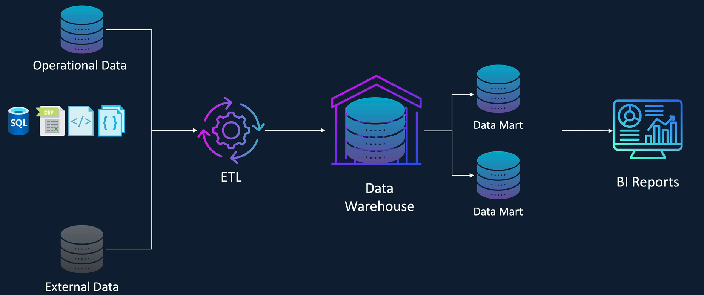

# About

This is the guideline for the exam [Databricks Certified Data Engineer Associate](https://www.databricks.com/learn/certification/data-engineer-associate).

This `README.md` file will mostly reveal all necessary things to cope with the Databricks Certified DE Associate.

# Structure of the exam

1. Databricks Lakehouse Platform – 24%

   - Introduction to **Databricks Lakehouse** Platform
   - Databricks Workspace Components
   - Introduction to **Unity Catalog**

2. ELT With Spark SQL and Python – 29%

   - Overview
   - Querying data
   - Transforming data

3. Incremental Data Processing – 22%

   - Spark Structured Streaming
   - Delta Lake
   - DLT Overview
   - DLT - Pipelines and Notebooks

4. Production Pipelines – 16%

   - Databricks Jobs

5. Data Governance – 9%
   - Databricks SQL
   - Data governance

# 1. Databricks Lakehouse Platform

## History | Data Lakehouse Overview

### Data Warehouses

- Data Warehouse came into existence in 1980s when business wants to gather all **operational data** in one place rather than looking in each individual department. Some large data warehouses also gather **external** data to make intelligent decisions.
- Data warehouses were built on _traditional relational databases_ (or _massively parallel processing_ (**MPP**) engines).
  - Data received mainly in **SQL tables**, **CSV files** or **semi-structured** (JSON, XML).
  - Then, go through the **ETL process** to go into Data Warehouses/Marts (**data marts** contain cleaned data). Then, consumed for analytics.
- However, in early 2000s, due to the popularity of the Internet, a significant increase in volumes of data + a change in variety of data (**unstructed** data such as vids, imgs, ...), but data warehouses are not able to handle these data.  
  Moreover, the data was only loaded after being extracted and transformed -> took longer to develop a solution to get new data into data warehouse. And it's expensive to store data (_high data storage cost_) and yet provides support for Data Science or ML/AI workloads.
  

### Data Lake

- Data Lake came into existence around 2011.
- Not only handle **structured** and **semi-structured** data, but can also handle **unstructred** data
  - Raw data received is ingested into Data Lake **WITHOUT** any kind of cleansing or transformation -> result in quicker timescales to develop solutions as well as fast ingestion time.
  - Data Lakes were built on cheap storage solution like **HDFS** (_Hadoop Distributed File System_), **Amazon S3** or **ADLS Gen2** -> cost of storage is cheap -> ingest freely without much worrying
  - Support **Data Science** and **ML workloads** by providing access to the **raw data** as well as the **transformed data**
- However, there is a problem: Data Lakes are too slow to service **interactive BI reports**, and **lack of data governance**.

  Thus, companies often copy a subset of the data from the **Data Lake** to a **Warehouse** to support BI reporting, which led to a complex architecture with many moving parts.

  Also, Data Lakes have no support for ACID transactions and unable to handle corrections to data (i.e., rewrite the entire partition). No roll back any data being written (no history or versioning).

### Data Lakehouse

- Can ingest both **operational** and **external** data into a Data Lakehouse
- Data Lakehouse is basically Data Lake with `ACID` transaction controls, came to existence since 2018 and rapidly evolving with **data governance capabilities**.

  Data Lakehouse achieves this using the file format **Delta Lake** (offer ACID support -> sealessly combine streaming and batch workloads) and a data governance solution called **Unity Catalog**.  
  Additionally, the Lakehouse integrates with PowerBI and Tableau, while also providing role-based access control for governance.

## Introduction to Medallion Architecture

The data architecture used in Data Lakehouse is commonly referred to as **medallion architecture** (_data design pattern_).

- The **bronze layer** typically contains raw data as _received from various data sources_. At this layer, the data usually undergoes minimal to no transformation (at most some additional metadata, such as load, timestamp, or the name of the file maybe added for **tracking purposes**) -> crucial for auditing and identifying data issues.

  By not transforming the data, we can maintain a historical record of all the data received -> easily replay the data if any pipeline issues occur later.

- The **silver layer** holds _filtered_, _cleansed_ and _enriched_ data with a _structure applied_ and _schema_ (either enforced or evolved) to **maintain consistency**.

  At this stage, the data undergoes **quality checks** where invalid records are _removed_, column values are _standardized_, duplicates are _eliminated_, and missing values are either _replaced/removed_.
  -> results in **structured**, **high quality** and **reliable** data, which is suitable for data science, machine learning and AI workloads.

- The **gold layer** contains business level aggregated data. Here, the data from the _silver layer_ is **further aggregated** and **enriched** with additional context to make it ready for **high level business reporting** and **analysis**.

  This layer is also used for advanced analytics and applications where needed.

### Benefits of Medallion Architecture

- Improve **data lineage** and **traceability** of the data by moving the data through the clearly defined data layers of _bronze_, _silver_ and _gold_ -> easier to track **where the data has come from** and **how it is transformed** and **used** in applications.
- Enforce data governance and compliance policies such as GDPR.
- The design pattern allows for processing only **new and changed** data received at the Data Lakehouse -> support **incremental processing**.
- Give better control over security (e.g., defining **role-based access** control) to ensure only authorized user can access secure and sensitive data.

## Introduction to Databricks

- At the core of Databricks is the open-source distributed compute engine called **Apache Spark**.

  > Apache Spark is a fast, unified analytical engine designed for big data processing and ML; originally developed at UC Berkeley in 2009 and open sourced in 2010. It utilizes in-memory computing and various optimizations. **Spark** runs on a _distributed computing platform_ and has a _unified engine_ that supports both batch and streaming workloads.

- Databricks provides the **Spark runtime**, which is highly optimized for Databricks platform and known to be up to 5 times faster than the _vanilla Apache Spark_.
- Databricks also comes with a _vectorized query engine_ called **photon**, which provides extremely fast query performance up to 8 times improvement on the standard Databricks runtime.
