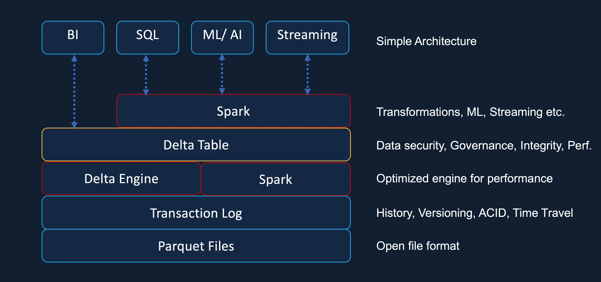

# Introduction

## What is Databricks?

- Is an **open analytic platform** for building, deploying, sharing and maintaining enterprise-grade data, analytics and AI solution at scale | built on Apache Spark
- Can: build an enterprise data lakehouse | ETL and data engineering | ML, AI … | data warehousing, analytics and BI | DevOps

# Create Azure Databricks Service

- Step 1: Acces [portal.azure.com](portal.azure.com) and choose _Create a resource_. Search for `Azure Databricks`.
- Step 2: Fill in the form.

  - Basics
    - Subscription: either Pay-As-You-Go or Student Account.
    - Resource group: where we keep all resources needed. Suggested name: `databrickscourse-rg`
    - Workspace name: suggested `databrickscourse-ws`
    - Region: choose the one that is (near) you for low latency. Regarding optimization for Student Account -> choose `UK South`
    - Pricing Tier: choose `Premium`
  - Networking: set all by default (unless you want your own configuration)

- Step 3: hit `Create` button. It will take quite a while (~5mins) to complete validation and creation.

- Step 4: Launch the workspace to actually use Databricks

# Overview of Databricks UI



- `New`: let you create some of Databricks objects, such as Notebooks, clusters, ... etc
- `Workspace`: a container for holding a set of folders, libraries and files. By default, each user has their **own workspace** and also **the shared one**. There is also Git in this section that allows you to migrate your work in GitHub.
- `Catalog`: let us interact with any tables that you created
- `Workflow`: contain jobs, job runs, and Delta Live Tables
- `Compute`: let us create clusters, cluster pools and SQL data warehouses.

## Architecture Overview


- Is split into 2 parts:
  - `Control Plane`: located in Databricks own subscription, containing:
    - Databricks UX
    - Cluster Manager: when a cluster is requested by the user, the Cluster Manager will create the required VM in our subscription via Azure Resource Manager
    - Databricks File System (DBFS)
    - Metadata about Clusters, Files Mounted, etc ...
  - `Data Plane`: located in the customer subscription. When creating Databricks services in Azure, there are 4 resources created in your own subscription:
    - A virtual Network and Network Security Group for the VNet
    - Azure Blob Storage for the default storage (_not recommend for the permanent data storage_)
    - A Databricks Workspace

# Databricks Cluster

## Cluster types

- A cluster is basically a collection of VMs, where each consists of a **Driver node** and (one or more) **Worker nodes**. <br>
  Clusters allow us to treat this group of computers as a **single compute engine** via the Driver node.
  

- There are 2 types of clusters:

|     |            All purpose             |             Job cluster             |
| :-- | :--------------------------------: | :---------------------------------: |
|     |          Created manually          |           Created by jobs           |
|     |             Persistent             |  Terminated at the end of the job   |
|     | Suitable for interactive workloads |  Suitable for automated workloads   |
|     |      Shared among many users       | Isolated just for the job workloads |
|     |          Expensive to run          |           Cheaper to run            |
|     |    -> Interactive analysis work    |     -> Repeated production work     |

<br>

- `Cluster Policy`: help us with pre-configuration, so that creating a Cluster will become easier. Also, it helps restrict the maximum size of the Clusters being created to keep the cost under control.

## Cluster Configuration


- `Single node` or `multi node`: Multi node will have one Driver node and (one or more) Workers node. Single node does not have Worker nodes, so only light-weight workload.
- `Access mode`: there are 4 types

  - **Single user**: only allows **a single user** to access the cluster. Supports Python, SQL, Scala, R.
  - **Shared**: multiple user access; provides process isolation -> each process gets its environment, so one cannot see the data nor credentials from the other.
  - **No isolation shared**: also allows the Cluster to be shared amongst more than one user. Different from the `shared` mode is that this does not provide any process isolation, thus failure in one user's process may affect the others. <br>
    Also, it does not offer any task preemption -> one running process may use up all the resources and the other may fail.

- Runtime: the set of core libraries that run on Databricks Clusters. There are 4 types:
  - Databricks runtime: includes an optimized version of Apache Spark library | Scala, Java, Python, R | Ubuntu libraries | GPU libraries | Delta Lake | other Databricks services
  - Databricks runtime ML: Databricks runtime + ML libraries (PyTorch, Keras, TensorFlow, XGBoost, ...)
  - Photon runtime: Databricks runtime + Photon Engine (i.e., Databricks native vectorized query engine that runs SQL workloads faster and reduces your cost per workload).
  - Databricks runtime light: for jobs that are not requiring advanced features such as auto scaling, reliability, and improved performance. <br>
    It is only suitable for Automated Workloads, cannot use it for Interactive Workloads nor Notebook jobs.
- Auto termination: avoid unnecessary costs on ilde clusters (terminate cluster after _n minutes_ of inactivity)
- Auto scaling: automatically add/remove nodes from the Cluster depending on your workload.
- Cluster VM Type/Size:

  - Memory Optimized: recommend for memory intensive applications. E.g., a ML workload that caches a lot of data in memory.
  - Compute Optimized: useful for structured streaming applications, where you need to make sure that the processing rate is above the input rate at peak times of the day.
  - Storage Optimized: recommended for use cases requiring high disk throughput and I/O.
  - General Purpose: recommended for Enterprise applications and analytics with in-memory caching.
  - GPU Accelerated: recommended for Deep Learning models which are data and compute intensive.

- Cluster Policy (_only available in Premium Tier_): Administrators can create policies with restrictions, and assign them to users/groups -> achieve cost control by limiting the maximum size of clusters.

## Azure Databricks Pricing

- Depends on a number of factors:

  - Type of workload (All purpose, Jobs compute, Databricks SQL, Photon Engine...)
  - Tier of Databricks workspace (Standard/Premium)
  - VM type (General Purpose/GPU/Optimized)
  - Purchase plan (Pay-as-you-go/Pre-purchases)
  - We also have to pay for the VM themselves too.

  ### Databricks Unit

  - Is a normalized unit of processing power on the Databricks Lakehouse Platform used for measurement and pricing purposes.

## Azure Databricks Cluster Pool

- Clusters usually take time to start up an Auto Scale. In order to minimize that time, we can use **Pools**. <br>
  -> Cluster Pool is basically a set of idle, ready to use VMs that allow us to reduce the Cluster start and Auto Scaling time. E.g.,

## Cluster Policy

- Is basically a set of rules which allows us to hide or take out the configuration options. They allow us to fix the values of some of the configuration params and restrict access for the users -> easier UI.
- An admin can create a policy and assign that to a set of users.
- Cluster policies take away **the need for an administrator** to be involved in every cluster creation decision.

  ### Define the policy

  - JSON format

  ```
    {
      "spark_conf.spark.databricks.cluster.profile": {
        "type": "fixed",
        "value": "singleNode",
        "hidden": true
      },
      "node_type_id": {
        "type": "allowlist",
        "values": [
          "Standard_DS3_v2",
          "Standard_D3_v2",
          "Standard_DS12_v2",
          "Standard_D12_v2"
        ],
        "defaultValue": "Standard_DS3_v2"
      },
      "autotermination_minutes": {
        "type": "fixed",
        "value": 20
      },
      "spark_version": {
        "type": "fixed",
        "value": "auto:latest-lts",
        "hidden": true
      },
      "cluster_type": {
        "type": "fixed",
        "value": "all-purpose"
      }
    }
  ```

  

  - You can also override (inherit) the policy.

# Databricks Notebooks

## Magic command

- In case you want to write SQL commands in a Python environment -> follow this command:

  ```
  %sql
  SELECT ...
  ```

- To list all the files in system -> use this command:
  ```
  %fs
  ls
  ```
