# About

## Some general knowledge

### What is virtualization?

- In the virtual machine, we are able to run the whole OS. This technique is usually used in the Cloud when deploying, such as AWS. Typically, what you are doing is putting up a new virtual machine and you can then deploy your code onto.
- A virtual machine has a type of program that can run and manage the life cycle of these machines, which is called **Hypervisor**. E.g., VMWare.

### What is containerization?

- Docker manages the life cycle of containers and it then runs them and interacts with them.
- To sum up, containerization is the ability to create a light-weight environment where processes can run on a host operating system. They share all things in that operating system but they cannot touch anything outside that bounded box.

## What is Docker?

- A software development platform makes it easy to develop and deploy apps
  inside of neatly packed **virtually containerized environment**. <br>

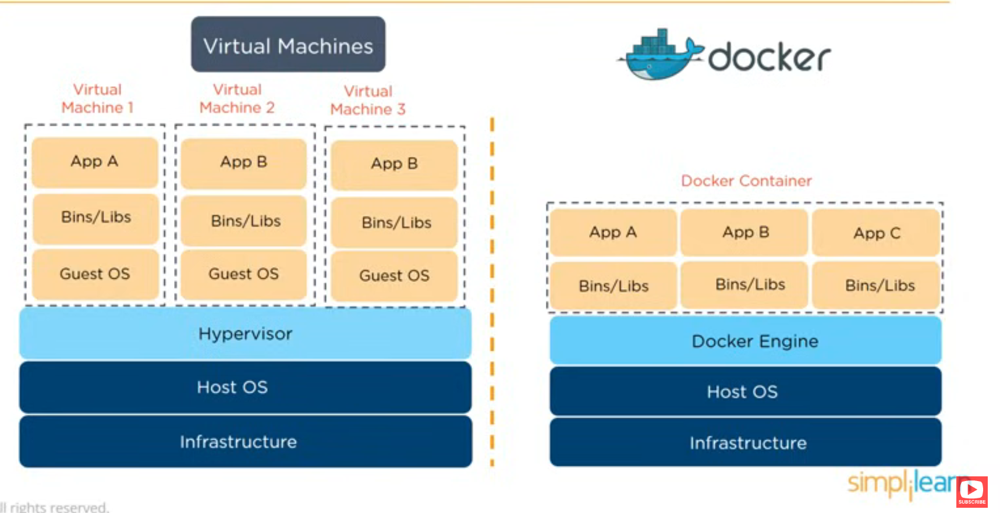

|              |                              VM                               |                            Docker                            |
| :----------- | :-----------------------------------------------------------: | :----------------------------------------------------------: |
| OS support   |                  Occupies a lot of mem space                  |                      Occupy less space                       |
| Boot-up time |                       Long boot-up time                       |                      Short boot-up time                      |
| Performance  |      Running multiple VMs leads to unstable performance       | Better performance as it is hosted in a single Docker engine |
| Scaling      |                     Difficult to scale up                     |                       Easy to scale up                       |
| Efficiency   |                        Low efficiency                         |                       High efficiency                        |
| Portability  | Compatibility issues while porting across different platforms |          Easily portable across different platforms          |

## Components

1. Dockerfile: is just code telling Docker how to build an image.
2. Image: is a snapshot of all softwares and their dependencies down to the OS level \
   -> is used for running Docker Containers.
   Images can be stored in either public or private repos, but usually public repos are used to host Docker Images which can be used by everyone.
   - Immutable, i.e., cannot be modified after being created.
   - Composed of layers; each layers represents a set of file system that changes, add, remove or modify files.
3. Container: is a standalone, executable software package which includes applications and their dependencies.
4. Registry: contains repos where Images are stored, which allows you to share images across teams. \
   Docker also has its own default registry called Docker Hub.

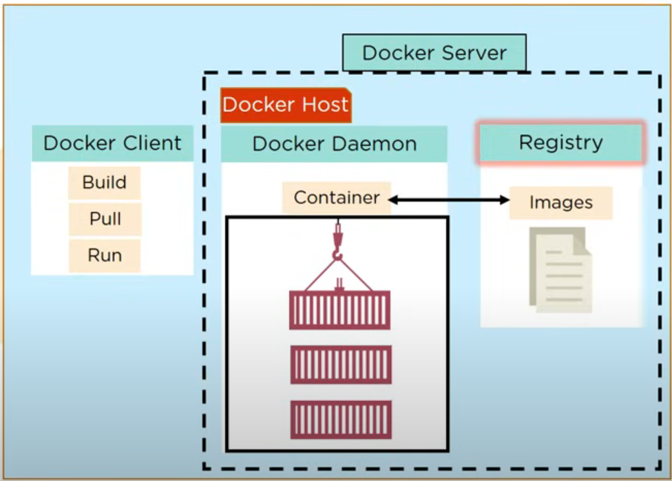

## Basic commands

- To build a container -> `pull` is used to get a Docker image from the Docker repo.
- With `push` -> store the Docker Image in Docker Registry.

## Summary

- Dockerfile -> build -> Docker Image contains all project's code
  -> run -> Docker Containers -> once the Image is built, it's uploaded in a Registry or a Docker Hub -> From Docker Hub, users can get the Docker Image and build new containers.

  

# Installation

## First step

Download Docker Desktop from their [official page.](https://docs.docker.com/get-started/introduction/get-docker-desktop/) \
After downloading, run the `.exe` file to set up Docker. \
After having finished setting up, open terminal, run `docker -v` to make sure Docker is indeed installed.


## Run the first container

Open your CLI terminal and start a container by running the `docker run` command:

```<bash>
docker run -d -p 8080:80 docker/welcome-to-docker
```

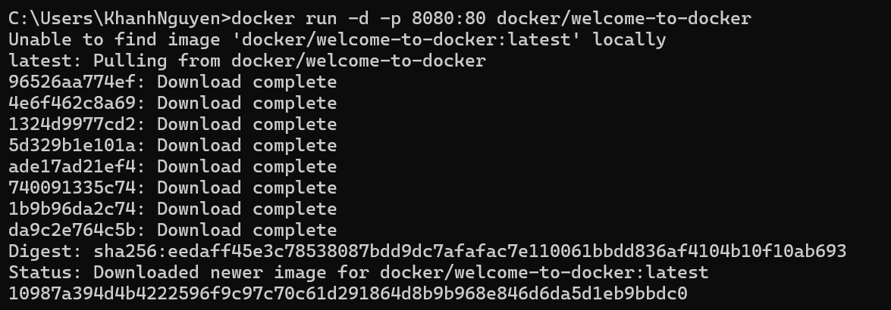

For this container, the frontend can be accessed on port 8080. Open via your [localhost](http://localhost:8080).

## Stop the container

The container continues until you stop it. You can stop a cointainer using `docker stop`

- Run `docker ps` to get the ID of the container.
- Provide the container ID or name to the `docker stop`:

```<bash>
docker stop <the-container-id>
```

# More about

Now, let's dive into the basics !!!

## Running containers

A `docker run` command takes the following form:

```
docker run [OPTIONS] IMAGE[:TAG|@DIGEST] [COMMAND] [ARG...]
```

- An image tag is the image version, which defaults to latest.
  Use the tag to run a container from specific version of an image. \
  For example, to run version **24.04** of the ubuntu image: `docker run ubuntu:24.04`.
- [OPTIONS] let you configure options for the container. \
  For example, you can give the container a name `(--name)`,
  or run it as a background process `(-d)`.
- [COMMAND] and [ARG...] are positional arguments
  to specify commands and arguments for the container
  to run when it starts up. \
  For example, you can specify `sh` as the [COMMAND],
  combined with the `-i` and `-t` flags, to start an interactive shell in the container (if the image you select has an sh executable on PATH).
  ```<bash>
  docker run -it IMAGE sh
  ```

## Dealing with Images

### Search and download an image

Open the terminal and search for images :

```
docker search docker/welcome-to-docker
```

If an error is encountered for WSL2/Ubuntu (something like
`Error response from daemon: open \\.\pipe\docker_engine_windows: The system cannot find the file specified docker error`),
then you may need to adjust in Docker Destop. \
Go to Docker Desktop -> **Settings** -> tab **Resources** -> **WSL integration** -> turn on the `Ubuntu` option.
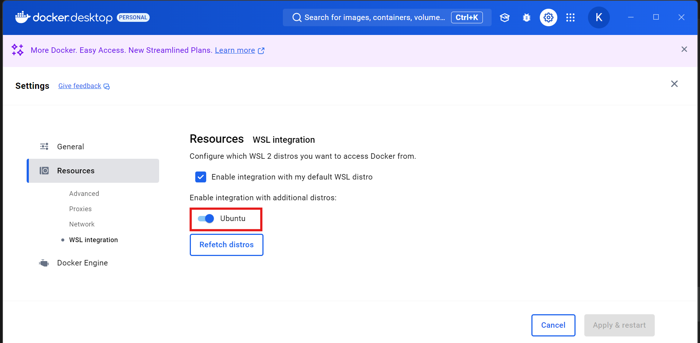
Upon running, the terminal shows:
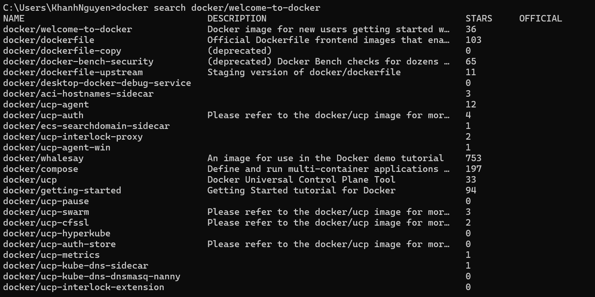

Download the image using command `pull`:

```
docker pull docker/welcome-to-docker
```

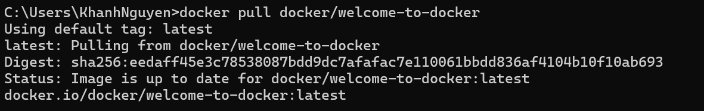

### Learn about the image

1. List the download images using:
   ```
   docker image ls
   ```
   Or
   ```
   docker images
   ```
2. List the image's layers using:
   ```
   docker image history docker/welcome-to-docker
   ```
   This output shows you all of the layers, their sizes,
   and the command used to create the layer.

## Dealing with Registries

### Registry vs Repository

A registry is a centralized location that stores and manages
container images, whereas a repository is a collection
of related container images within a registry.

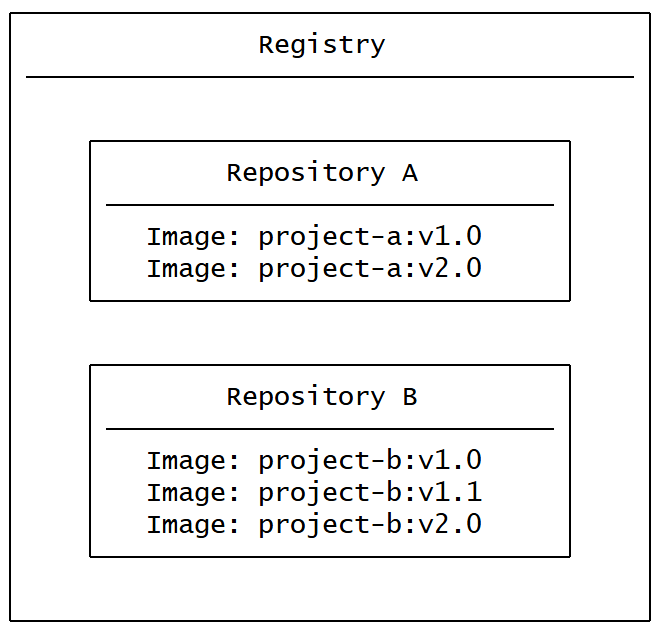

### Example

1. Clone this github repo (a sample Node.js project with pre-built Dockerfile):
   ```
   git clone https://github.com/dockersamples/helloworld-demo-node
   ```
2. Navigate to the cloned folder.
3. Run the following command to build the Image:
   ```
   docker build -t <YOUR_DOCKER_USERNAME>/docker-quickstart .
   ```
   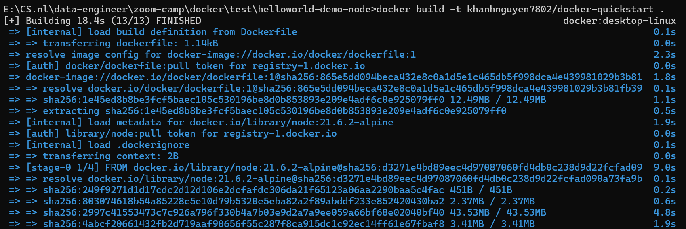
4. Use `docker images` to view the newly created Docker Image.
5. Use the `docker tag` to label the version of Image:
   ```
   docker tag <YOUR_DOCKER_USERNAME>/docker-quickstart <YOUR_DOCKER_USERNAME>/docker-quickstart:1.0
   ```
6. Push to Docker Hub

   ```
   docker push <YOUR_DOCKER_USERNAME>/docker-quickstart:1.0
   ```

   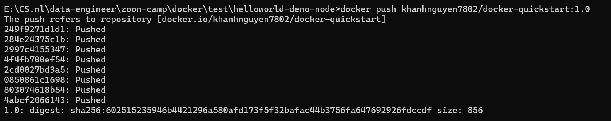

7. Go to [Docker Hub](https://hub.docker.com/) to view your Image.
   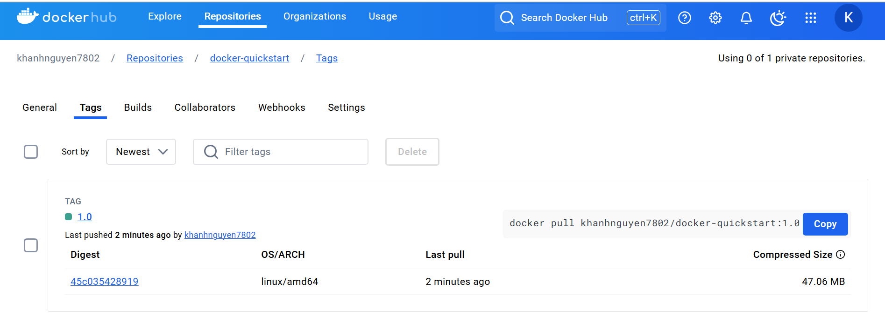

## Docker Compose

### Why do we need this ?

- How to work with complicated containers (e.g., run databases, message queues, caches...)? Install everything in a single container? Run multiple containers? If run multiple, how to connect them? \
  -> Each container should do one thing and do it well.

### Usage

With **Docker Compose**, you can define all of your containers and their configurations in a single YAML file.

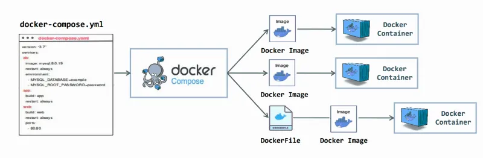

- `Dockerfile vs Compose file`

|     |                     Dockerfile                      |         Compose file          |
| :-- | :-------------------------------------------------: | :---------------------------: |
|     | provide instructions to **build a container image** | define your running container |

> _Quite often, a Compose file references a Dockerfile to build an image to use for a particular service._

#### Example

1. Clone this github repo (a sample Node.js project with MySQL as database server):
   ```
   git clone https://github.com/dockersamples/todo-list-app
   ```
2. Navigate to the cloned folder, where you will find a file named `compose.yaml`. \
   It defines all the services that make up the application, along with their configurations. Each service specifies its image, ports, volumes, networks, and any other settings necessary for its functionality.
3. Use `docker compose up` to start the application:

   ```
   docker compose up -d --build
   ```

   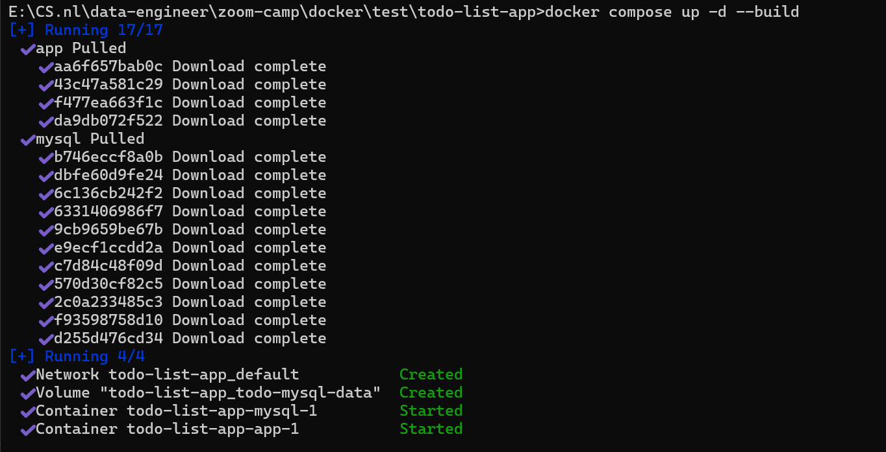

   - Two container images were downloaded from Docker Hub - node and MySQL
   - A network was created for your application
   - A volume was created to persist the database files between container restarts
   - Two containers were started with all of their necessary config

4. Open [localhost](http://localhost:3000) to view the page.
5. After having done all, you can simply tear it down (stop and remove containers and networks (optionally images and volumes as well)).

   ```
   docker compose down
   ```

   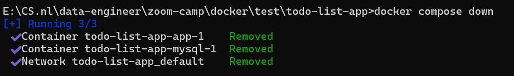

## Building Images

### Understanding the image layers

- Image layer is a change on an image. \
  Every command you specify (in `Dockerfile`) causes the previous image to change (additions, deletions, or modifications),
  thus creating a new layer.

- This is beneficial as it allows layers to be reused between images.
  

- Because layers are **intermediate images**,
  if you make a change to your `Dockerfile`,
  docker will rebuild only the layer that
  was changed and the ones after that.
  (i.e., `layer caching`)

```
FROM ubuntu                #This has its own number of layers say "X"
MAINTAINER FOO             #This is one layer
RUN mkdir /tmp/foo         #This is one layer
RUN apt-get install vim    #This is one layer

This will create a final image where the total number of layers will be X+3
```

### Stacking the layers

1. After each layer is downloaded,
   it is extracted into its own directory on the
   host filesystem.
2. When you run a container from an image,
   a union filesystem is created where
   layers are stacked on top of each other,
   creating a new and unified view.
3. When the container starts,
   its root directory is set to the
   location of this unified directory, using `chroot`.
   When the union filesystem is created,
   in addition to the image layers,
   a directory is created specifically
   for the running container. \
   \
   This allows the container to make filesystem changes
   while allowing the original image layers to remain untouched.
   This enables you to run multiple containers from the same underlying image.
### How to write a Dockerfile?
