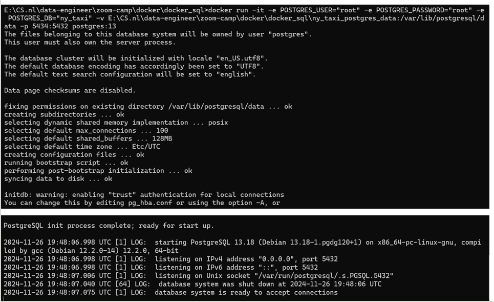
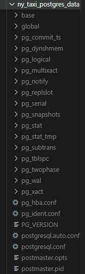

# Guide to ingest NY Taxi Data to Postgres 
### 1. Create a folder to contain the database 
Create a folder to contain the later database. 
### 2. Run script 
Run the following script in terminal:
```
docker run -it -e POSTGRES_USER="root" -e POSTGRES_PASSWORD="root" -e POSTGRES_DB="ny_taxi" -v absolute/path/to/database/folder:/var/lib/postgresql/data -p 5434:5432 postgres:13
```
- `docker run -it`: start a new Docker container interactively with a terminal session 
- `-e POSTGRES_USER="root" -e POSTGRES_PASSWORD="root" -e POSTGRES_DB="ny_taxi"`: define the environment by setting username, password for the user, and name the database when created.
- `-v absolute/path/to/database/folder:/var/lib/postgresql/data`: volume mapping; map the host directory (i.e., absolute path to the database folder) to the container's postgresql data directory. 
- `-p 5434:5432`: port mapping; your local port 5434 will be mapped to the container port 5432 (i.e., the default port of postgresql) -> can connect to postgresql on the host machine using localhost:5434
- `postgres:13`: specify the Docker image to use (`postgres`) and the version (13). 

After running the script, you should get something like this: 

And the database should have this set up: \


### 3. Install pgcli 
- Should be able to install through `pip install pgcli`
- However, it does not in my case. Instead, I used `conda` to go into a new environment and install the package: 
```
conda install conda-forge::pgcli 
``` 

### 4. Check if `pgcli` is correctly installed 
- Open terminal, (since I added Git CMD to Path in Environment Variable, thus can use `Linux` command in Windows terminal) 
  ```
  conda activate <the-environment-that-package-is-installed>
  ```
- Now, you are perhaps logged in with the default user of your local machine, however, you may encounter **connection failed: connection to server at "localhost" (::1), port 5432 failed: FATAL:  password authentication failed for user ...**  due to the owner of DB server is `postgres`-> specify clearly
  ```
  pgcli -h localhost -p 5434 -u root -d ny_taxi
  ```


### 5. Open Jupyter Notebook 
- Use Anaconda Prompt to open jupyter notebook (can be installed `pip install notebook` if you have not had it yet)

### 6. Download the dataset 
- The dataset can be found via this [link](https://www.nyc.gov/site/tlc/about/tlc-trip-record-data.page). 
- We used the 'Yellow Taxi Trip Records'.

### 7. Using Jupyter notebook to upload data 
- Refer to `upload-data.ipynb`.


## Errata
1. Error response from daemon: Ports are not available: exposing port TCP 0.0.0.0:5432 -> 0.0.0.0:0: listen tcp 0.0.0.0:5432: bind: address already in use. \
-> Change the port, example 5434:5432

2. If you still don't see any files in the directory that is created, check permissions for the current user first. Changing the directory to have read permissions by non-owners was required for the files to show up in VSCode. \
Granting permissions like this is not recommended unless you are ok with all users being able to read the data. 
    ```
    sudo chmod -R 744 full/path/to/nyc_taxi/directory
    ```