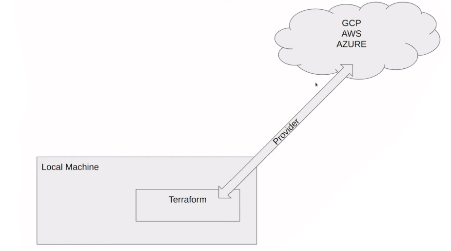

# About

## What is Infrastructure as Code (IaC)?

- Use DevOps methodology and versioning with a descriptive model to define and deploy infrastructure, such as networks, virtual machines, load balancers, and connection topologies.
- An IaC model generates **the same environment every time it deploys.** -> a component for continuous delivery (CD) to **avoid manual configuration** to enforce consistency.
- IaC should use declarative `definition files` if possible. A definition file describes the components and configuration that an environment requires, but not necessarily how to achieve that configuration.

## What is Terraform?

- An infrastructure as code (IaC) tool that lets you define both cloud and on-prem resources in human-readable configuration file that you can version, reuse and share.

## Why use Terraform

- Simplicity in keeping track of infrastructure
- Easier collaboration: just a file, can easily push to github for others to review
- Reproducibility
- Ensure resources are removed
