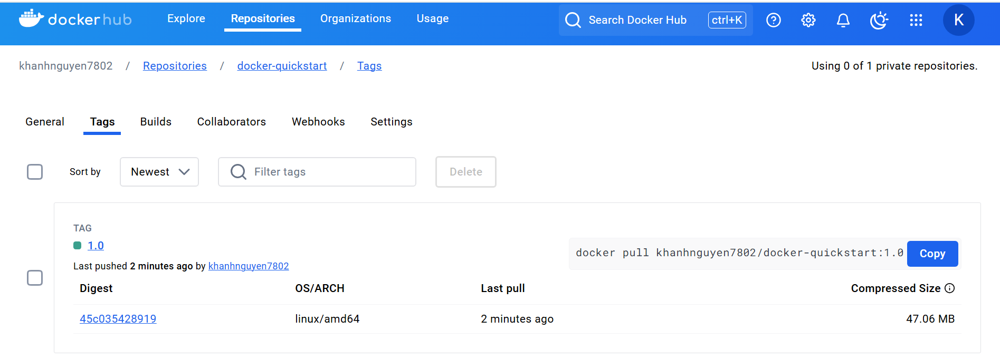
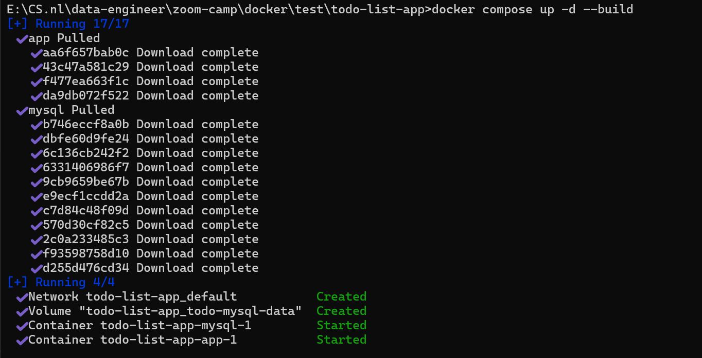
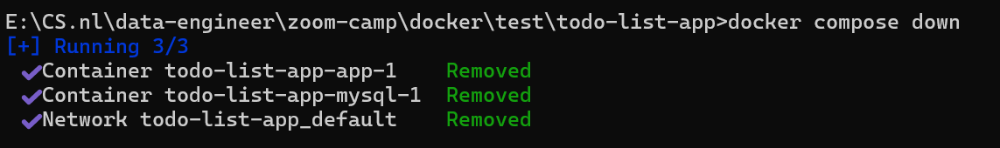

# Docker commands

## Dealing with Containers

To run a container, use `docker run`.
The command takes the following form:

```docker
docker run [OPTIONS] IMAGE[:TAG|@DIGEST] [COMMAND] [ARG...]
```

- An image tag is the image version, which defaults to latest.
  <br> E.g., to run version **24.04** of the ubuntu image: `docker run ubuntu:24.04`.
- [OPTIONS] let you configure options for the container. \
  For example, you can give the container a name `(--name)`,
  or run it as a background process `(-d)` (detached).
- [COMMAND] and [ARG...] are positional arguments
  to specify commands and arguments for the container
  to run when it starts up. \
   For example, you can specify `sh` as the [COMMAND],
  combined with the `-i` and `-t` flags, to start an interactive shell in the container (if the image you select has an sh executable on PATH).
  ```docker
  docker run -it IMAGE sh
  ```
  <br>

To start/stop container, use `docker <start/stop> <container_id>`.

To remove a container, use `docker rm <container_id>`.

To access the inner terminal of a container, use `docker exec -it <container_id> bash`.

## Dealing with Images

### Search and download an image

Open the terminal and search for images :

```docker
docker search docker/welcome-to-docker
```

If an error is encountered for WSL2/Ubuntu (something like
`Error response from daemon: open \\.\pipe\docker_engine_windows: The system cannot find the file specified docker error`),
then you may need to adjust in Docker Destop. \
Go to Docker Desktop -> **Settings** -> tab **Resources** -> **WSL integration** -> turn on the `Ubuntu` option.

Upon running, the terminal shows:


Download the image using command `pull`:

```
docker pull docker/welcome-to-docker
```


### Building Images

#### Understanding the image layers

- Image layer is a change on an image. \
  Every command you specify (in `Dockerfile`) causes the previous image to change (additions, deletions, or modifications),
  thus creating a new layer.

- This is beneficial as it allows layers to be reused between images.
  

- Because layers are **intermediate images**,
  if you make a change to your `Dockerfile`,
  docker will rebuild only the layer that
  was changed and the ones after that.
  (i.e., `layer caching`)

```docker
FROM ubuntu                #This has its own number of layers say "X"
MAINTAINER FOO             #This is one layer
RUN mkdir /tmp/foo         #This is one layer
RUN apt-get install vim    #This is one layer

This will create a final image where the total number of layers will be X+3
```

### Stacking the layers

1. After each layer is downloaded,
   it is extracted into its own directory on the
   host filesystem.
2. When you run a container from an image,
   a union filesystem is created where
   layers are stacked on top of each other,
   creating a new and unified view.
3. When the container starts,
   its root directory is set to the
   location of this unified directory, using `chroot`.
   When the union filesystem is created,
   in addition to the image layers,
   a directory is created specifically
   for the running container. \
   \
   This allows the container to make filesystem changes
   while allowing the original image layers to remain untouched.
   This enables you to run multiple containers from the same underlying image.

### Additional command

1. List the download images using:
   ```docker
   docker image ls
   ```
   Or
   ```
   docker images
   ```
2. List the image's layers using:
   ```
   docker image history docker/welcome-to-docker
   ```
   This output shows you all of the layers, their sizes,
   and the command used to create the layer.

## Dealing with Registries

### Registry vs Repository

A registry is a centralized location that stores and manages
container images, whereas a repository is a collection
of related container images within a registry.


### Example

1. Clone this github repo (a sample Node.js project with pre-built Dockerfile):
   ```
   git clone https://github.com/dockersamples/helloworld-demo-node
   ```
2. Navigate to the cloned folder.
3. Run the following command to build the Image:
   ```
   docker build -t <YOUR_DOCKER_USERNAME>/docker-quickstart .
   ```
   
4. Use `docker images` to view the newly created Docker Image.
5. Use the `docker tag` to label the version of Image:
   ```
   docker tag <YOUR_DOCKER_USERNAME>/docker-quickstart <YOUR_DOCKER_USERNAME>/docker-quickstart:1.0
   ```
6. Push to Docker Hub

   ```
   docker push <YOUR_DOCKER_USERNAME>/docker-quickstart:1.0
   ```

   

7. Go to [Docker Hub](https://hub.docker.com/) to view your Image.
   

## Docker Compose

### Why do we need this ?

- How to work with complicated containers (e.g., run databases, message queues, caches...)? Install everything in a single container? Run multiple containers? If run multiple, how to connect them? \
  -> Each container should do one thing and do it well.

### Usage

With **Docker Compose**, you can define all of your containers and their configurations in a single YAML file.


- `Dockerfile vs Compose file`

|     |                     Dockerfile                      |         Compose file          |
| :-- | :-------------------------------------------------: | :---------------------------: |
|     | provide instructions to **build a container image** | define your running container |

> _Quite often, a Compose file references a Dockerfile to build an image to use for a particular service._

#### Example

1. Clone this github repo (a sample Node.js project with MySQL as database server):
   ```
   git clone https://github.com/dockersamples/todo-list-app
   ```
2. Navigate to the cloned folder, where you will find a file named `compose.yaml`. \
   It defines all the services that make up the application, along with their configurations. Each service specifies its image, ports, volumes, networks, and any other settings necessary for its functionality.
3. Use `docker compose up` to start the application:

   ```
   docker compose up -d --build
   ```

   

   - Two container images were downloaded from Docker Hub - node and MySQL
   - A network was created for your application
   - A volume was created to persist the database files between container restarts
   - Two containers were started with all of their necessary config

4. Open [localhost](http://localhost:3000) to view the page.
5. After having done all, you can simply tear it down (stop and remove containers and networks (optionally images and volumes as well)).

   ```
   docker compose down
   ```

   

## How to write Dockerfile

For more info, refer to [the complete folder containing Dockerfile](./complete-dockerization).

- `FROM <image>`: define a base for the Image. All instructions that follow are executed in this base image (e.g., in the Python environment).
- `RUN <command>` (when building images): Execute any commands in a new layer on top of the current image and commit the result.
- `WORKDIR <directory>`: Set the working directory for any `RUN`, `CMD`, `ENTRYPOINT`, `COPY`, and `ADD` instructions that follow it in the Dockerfile.
- `COPY <src> <dst>`: Copy new files or directories from `<src>` (i.e., from the local build context) and add them to the filesystem of the container at the path `<dest>`.
- `ENTRYPOINT>`: specify default executables; works similar to `CMD`, but it does not allow to override the command.

  - Shell form: `ENTRYPOINT command param1 param2`
  - Exec form: `ENTRYPOINT ["executable", "param1", "param2"]`
    <br>

  **Example 1:** `ENTRYPOINT ["python", "app.py"]`: when this container starts, it launches a Python interpreter and executes the `app.py` script to act as your container’s default behavior.
  <br>

  **Example 2 (combine with CMD):** By combining with `CMD`, we are able to override the parameters passed.

  ```docker
  ENTRYPOINT ["python", "app.py"]
  CMD ["--help"]
  ```

  In this example, no command line args = executing `python app.py --help` by default. However, if you provide arguments (e.g., `docker run <image> --version`), then it will result in `python app.py --version`.

- `CMD <command>`: what command the container should execute when launched. Each Dockerfile only has one CMD, and only the **last** CMD instance is respected when multiple exist.
