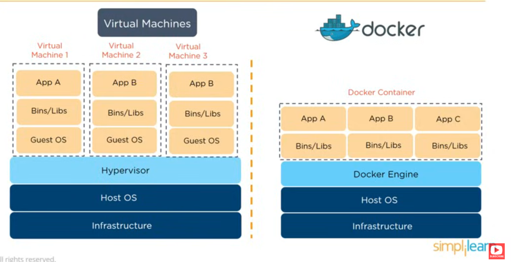
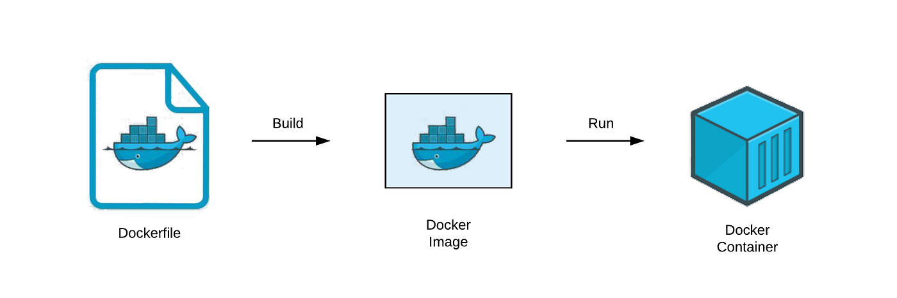
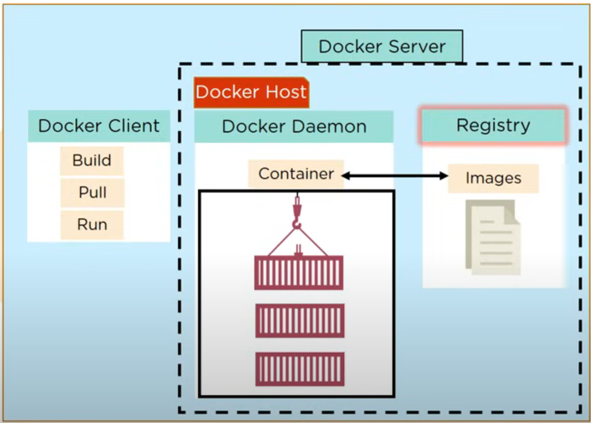
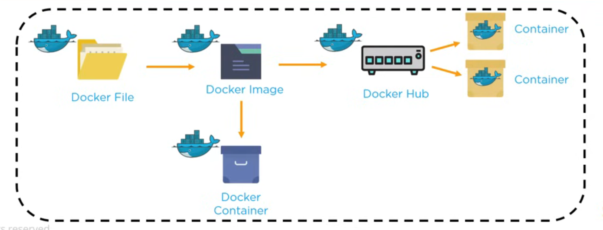
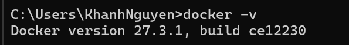
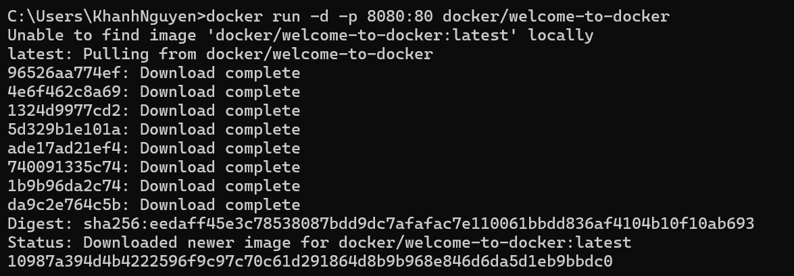

# About

This is the overview of Docker.

---

# 📖 Table of Contents

1. [General knowledge](#some-general-knowledge)
2. [What is Docker?](#what-is-docker)
3. [Installation](#installation)
4. [Details about the commands](#details-about-commands)
---

## Some general knowledge

### What is virtualization?

In the virtual machine, we are able to run the whole OS.

A virtual machine has a type of program that can run and manage the life cycle of these machines, which is called **Hypervisor**. E.g., VMWare.

### What is containerization?

Containerization is the ability to create a **light-weight environment** where processes can run on a host operating system, sharing all things in that operating system but they cannot touch anything outside that bounded box.

## What is Docker?

- A software development platform makes it easy to develop and deploy apps
  inside of neatly packed **virtually containerized environment**. <br>



|              |                              VM                               |                            Docker                            |
| :----------- | :-----------------------------------------------------------: | :----------------------------------------------------------: |
| OS support   |                  Occupies a lot of mem space                  |                      Occupy less space                       |
| Boot-up time |                       Long boot-up time                       |                      Short boot-up time                      |
| Performance  |      Running multiple VMs leads to unstable performance       | Better performance as it is hosted in a single Docker engine |
| Scaling      |                     Difficult to scale up                     |                       Easy to scale up                       |
| Efficiency   |                        Low efficiency                         |                       High efficiency                        |
| Portability  | Compatibility issues while porting across different platforms |          Easily portable across different platforms          |

### Components

1. `Dockerfile`: is just code telling Docker how to build an image.
2. `Image`: is a snapshot of all softwares and their dependencies down to the OS level \
   -> is used for running Docker Containers, can be stored in either public or private repos.
   - Immutable, i.e., cannot be modified after being created.
   - Composed of **layers**; each layer represents a set of file system that changes, add, remove or modify files.
3. `Container`: is a standalone, executable software package which includes applications and their dependencies.



4. `Registry`: contains repos where Images are stored, which allows you to share images across teams. \
   Docker also has its own default registry called Docker Hub.



## Workflow

- Dockerfile -> build -> Docker Image contains all project's code
  -> run -> Docker Containers -> once the Image is built, it's uploaded in a Registry or a Docker Hub -> From Docker Hub, users can get the Docker Image and build new containers.

  

## Installation

### Download Docker

Download Docker Desktop from their [official page.](https://docs.docker.com/get-started/introduction/get-docker-desktop/) \
After downloading, run the `.exe` file to set up Docker. \
After having finished setting up, open terminal, run `docker -v` to make sure Docker is indeed installed.


### Run the first container

Open your CLI terminal and start a container by running the `docker run` command:

```<bash>
docker run -d -p 8080:80 docker/welcome-to-docker
```

- Maps a port from local machine (**8080**) to a port inside the container (80).



For this container, the frontend can be accessed on port 8080. Open via your [localhost](http://localhost:8080).

### Stop the container

The container continues until you stop it. You can stop a cointainer using `docker stop`.

- Run `docker ps` to get the ID of the container.
- Provide the container ID or name to the `docker stop`:

```<bash>
docker stop <the-container-id>
```

# Details about commands
Pls refer to [Docker commands](docker-commands.md)!!!

You can always find more commands by `docker help`.