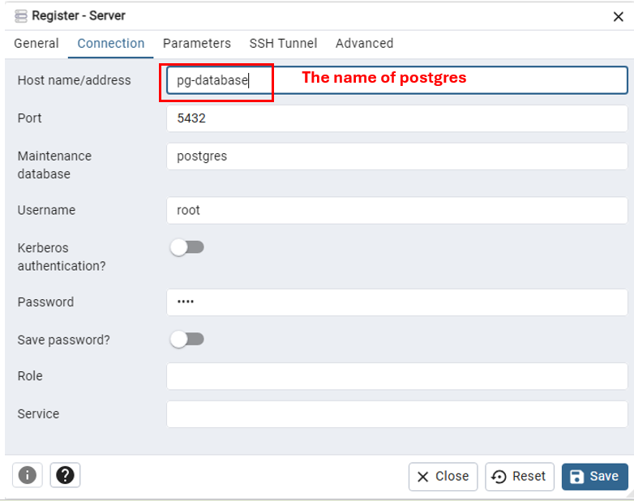

# Guide to ingest NY Taxi Data to Postgres

## Upload the data and Connect using `pgcli`

### 1. Create a folder to contain the database

Create a folder to contain the later database.

### 2. Run script

Run the following script in terminal:

```
docker run -it -e POSTGRES_USER="root" -e POSTGRES_PASSWORD="root" -e POSTGRES_DB="ny_taxi" -v absolute/path/to/database/folder:/var/lib/postgresql/data -p 5434:5432 postgres:13
```

- `docker run -it`: start a new Docker container interactively with a terminal session
- `-e POSTGRES_USER="root" -e POSTGRES_PASSWORD="root" -e POSTGRES_DB="ny_taxi"`: define the environment by setting username, password for the user, and name the database when created.
- `-v absolute/path/to/database/folder:/var/lib/postgresql/data`: volume mapping; map the host directory (i.e., absolute path to the database folder) to the container's postgresql data directory.
- `-p 5434:5432`: port mapping; your local port 5434 will be mapped to the container port 5432 (i.e., the default port of postgresql) -> can connect to postgresql on the host machine using localhost:5434
- `postgres:13`: specify the Docker image to use (`postgres`) and the version (13).

After running the script, you should get something like this:

And the database should have this set up: \


### 3. Install pgcli

- Should be able to install through `pip install pgcli`
- However, it does not in my case. Instead, I used `conda` to go into a new environment and install the package:

```
conda install conda-forge::pgcli
```

### 4. Check if `pgcli` is correctly installed

- Open terminal, (since I added Git CMD to Path in Environment Variable, thus can use `Linux` command in Windows terminal)
  ```
  conda activate <the-environment-that-package-is-installed>
  ```
- Now, you are perhaps logged in with the default user of your local machine, however, you may encounter **connection failed: connection to server at "localhost" (::1), port 5432 failed: FATAL: password authentication failed for user ...** due to the owner of DB server is `postgres`-> specify clearly
  ```
  pgcli -h localhost -p 5434 -u root -d ny_taxi
  ```

### 5. Open Jupyter Notebook

- Use Anaconda Prompt to open jupyter notebook (can be installed `pip install notebook` if you have not had it yet)

### 6. Download the dataset

- The dataset can be found via this [link](https://www.nyc.gov/site/tlc/about/tlc-trip-record-data.page).
- We used the 'Yellow Taxi Trip Records'.

### 7. Using Jupyter notebook to upload data

- Refer to `upload-data.ipynb`.

### Errata

1. Error response from daemon: Ports are not available: exposing port TCP 0.0.0.0:5432 -> 0.0.0.0:0: listen tcp 0.0.0.0:5432: bind: address already in use. \
   -> Change the port, example 5434:5432

2. If you still don't see any files in the directory that is created, check permissions for the current user first. Changing the directory to have read permissions by non-owners was required for the files to show up in VSCode. \
   Granting permissions like this is not recommended unless you are ok with all users being able to read the data.
   `   sudo chmod -R 744 full/path/to/nyc_taxi/directory`

## Using pgAdmin

We can install pAdmin, however, since we already got Docker, we can just pull an image of the tool and use that.

### 1. Get pgAdmin

- Access pgAdmin official page for [container](https://hub.docker.com/r/dpage/pgadmin4/).

### 2. Start the container

The image used is dpage/pgadmin4 and we will start a new container with defined params. All the requests we will send to port 8080 will be forwarded to port 80 on the container.

```
docker run -it -e PGADMIN_DEFAULT_EMAIL="admin@admin.com" -e PGADMIN_DEFAULT_PASSWORD="root" -p 8080:80 dpage/pgadmin4
```

Now, access pgAdmin via [localhost:8080](http://localhost:8080).

### 3. Connect the database to pgAdmin

- We are now facing the problem when trying to make connection, because we are running the pgAdmin inside a container, and localhost inside the container is trying to find postgresql. \
  Of course it cannot find because postgres is running in a different container. So, how do we actually connect it?

  -> Connect those 2 containers using a network.

First, open the terminal and create the network:

```
docker network create pg-network
```

Then, run a new container to create `postgres` with specified **network** and **name**. The **name** is important, since we will need that name to be the **host name** while registering a new server in pgAdmin.

```
docker run -it -e POSTGRES_USER="root" -e POSTGRES_PASSWORD="root" -e POSTGRES_DB="ny_taxi" -v absolute/path/to/database/folder:/var/lib/postgresql/data -p 5434:5432 --network=pg-network --name=pg-database postgres:13
```

Then, open a new terminal to also apply the same thing on `pgAdmin`. However, in this case, the name is optional.

```
docker run -it -e PGADMIN_DEFAULT_EMAIL="admin@admin.com" -e PGADMIN_DEFAULT_PASSWORD="root" -p 8080:80 --network=pg-network --name=pgadmin dpage/pgadmin4
```

After having finished executing, access to pgAdmin on the localhost and register a new server. It should be set up as:

The port is 5432 (default of pgAdmin).

### 4. Wrap up

Eventually, you should be able to create a new server. In this server, you will be able to find the `ny_taxi` database in this server. Also, you can query from the tables.

## Writing script for automation (alternative)

Let's say, instead of running each cell in `.ipynb` file to upload the data to Postgres. Now, only by executing the script file with provided params, we can automate those steps (refer to `ingest_data.py`).

```
python ingest_data.py --user=root --password=root --host=localhost --port=5434 --db=ny_taxi --table_name=yellow_taxi_data --url='https://d37ci6vzurychx.cloudfront.net/trip-data/yellow_tripdata_2024-01.parquet'
```

Because we are ingesting the data from our local machine, therefore the port specified is **5434** (which maps to port 5432 used for `Postgres`).

## Dockerization the Ingestion Script

Now, we can put everything into a container, such that we only need to run the container to get connected to `Postgres`.

- Create Dockerfile that contains all needed commands to start the pipeline. This Dockerfile basically builds up an Image (for building the container later on).

- Build the Image (it will base on the `Dockerfile` to build the image layers):

  ```
  docker build -t taxi_ingest:v001 .
  ```

- Now, we already had the Image, it's time to create a container from it.

  ```
  docker run -it --network=pg-network taxi_ingest:v001 --user=root --password=root --host=pg-database --port=5432 --db=ny_taxi --table_name=yellow_taxi_data --url='https://d37ci6vzurychx.cloudfront.net/trip-data/yellow_tripdata_2024-01.parquet'
  ```

## Docker Compose

Instead of running 2 separate terminals for `Postgres` and `pgadmin`, we can define those in a same `compose.yaml` file, so that when `compose.yaml` is executed, the 2 services will also start. \
Refer to `compose.yaml` file for more information. \
The `.yaml` file basically contains the (configuration) of **images** of the **services** that you want to start.

Simply go to the directory that contains `.yaml file`, open terminal and run:

```
docker compose up -d
```

- `-d` flag for detached -> terminal will not be hung up due to execution and you can freely type in terminal.
- To close the `compose`, run:

```
docker compose down
```
