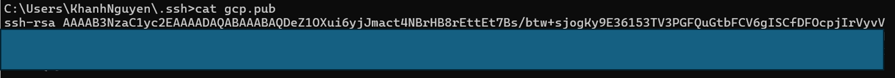
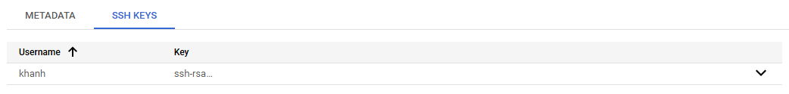
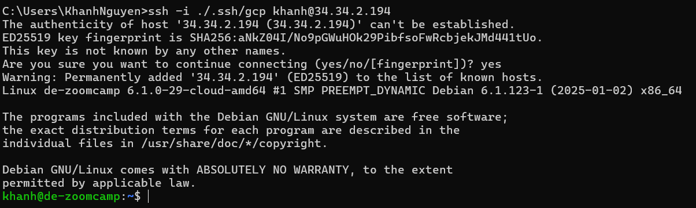
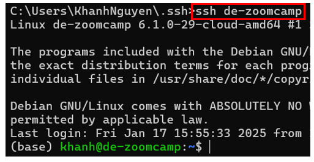

# Connect to Google Cloud Platform

## Generate SSH keys

- Step 1: According to [Google Cloud docs](https://cloud.google.com/compute/docs/connect/create-ssh-keys), we need to create an SSH key, so that we can add it to the VM on Google Cloud.

  ```
  ssh-keygen -t rsa -f ~/.ssh/KEY_FILENAME -C USERNAME
  ```

  - `-f`: specify the flie name
  - `-C`: the username
    This key will (usually) be generated in your `C:\Users\<HOST_NAME>\.ssh` folder.

- Step 2: go to Google Cloud Platform -> `Compute Engine tab` -> `Metadata` -> `Add SSH Keys` -> Copy all info of the public key -> paste in -> `Save`
  
  

## Create and connect to a VM instance on GCP

- Step 1: create a VM instance in GCP by: `Compute Engine` -> `Create an instance` -> choose series `E2` with machine type that has `4 (2 cores) vCPU, 16GB memory` -> `CREATE`

- Step 2: after creating, we can see that the VM has an **external IP** (which we will use to SSH our laptop with the VM).

  ```
  ssh -i /path/to/key/filename <username>@<internal_ip>
  ```

  

- Step 3: VOILA! YOU HAVE ALREADY SUCCEEDED IN CONNECTING TO A VIRTUAL MACHINE ON A CLOUD PLATFORM!

## Configure VM and setup local

- Step 1 (_optionally_): check version of GCP
  ```
  gcloud --version
  ```
- Step 2: download `Anaconda` on this VM. I downgraded the version (not the latest one) since my VM option does not have enough disk space (broke af 😭)
  ```
  curl -O https://repo.anaconda.com/archive/Anaconda3-2021.05-Linux-x86_64.sh
  ```
- Step 3: run the `.sh` file

  ```
  bash Anaconda3-2021.05-Linux-x86_64.sh
  ```

- Step 4 (_optionally_): create a `config-file` in localhost to ssh easier

  - Step 4.1: create a file called `config` in `.ssh` folder.
  - Step 4.2: configure as follow:
    ```
    Host de-zoomcamp
      HostName <internal_ip>
      User <username>
      IdentityFile /path/to/gcp/private/key
    ```
    **Example:**
    ```
    Host de-zoomcamp
      HostName 34.34.2.194
      User khanh
      IdentityFile C:/Users/KhanhNguyen/.ssh/gcp
    ```
    However, after shutting down, the VM will have a new different `internal_ip`, so you will need to update again.
  - Step 4.3: Now, you can ssh using only the Host

    ```
    ssh de-zoomcamp
    ```

    

    **Side note:** you can log out Anaconda using command `logout` or `Ctrl + D`

## Download external libraries

- Step 1: download Docker
  ```
  sudo apt-get update
  sudo apt-get install docker
  sudo apt-get install docker.io
  ```
- Step 2: test `docker run`

  ```
  docker run hello-world
  ```

  At this step, you might encounter the error regarding `permission denied` as you have to use `sudo` everytime docker is involved. To solve this:

  - Step 2.1: add the `docker` group if it doesn't already exist
    ```
    sudo groupadd docker
    ```
  - Step 2.2: add the connected user `$USER` to the docker group. Optionally change the username to match your preferred user.

    ```
    sudo gpasswd -a $USER docker
    ```

  - Step 2.3: restart the `docker` daemon so that the group membership is re-evaluated. Also, `logout` if restart does not work.

    ```
    sudo service docker restart
    ```

- Step 3: On Linux, there is no `docker compose`. Thus, we have to manually add it. Refer to ["Install the plugin manually"](https://docs.docker.com/compose/install/linux/#install-the-plugin-manually)

  - Step 3.1: create a `bin` folder to contain the later `docker-compose` and navigate to it
    ```
    mkdir bin
    cd bin/
    ```
  - Step 3.2: get the link of the desired release of Linux_x86_64 and download, also rename the `output file`.
    ```
    wget https://github.com/docker/compose/releases/download/v2.32.3/docker-compose-linux-x86_64 -O docker-compose
    ```
  - Step 3.3: although it is an **executable** file but the system doesn't know -> provide _execute_ control for the file.
    ```
    chmod +x docker-compose
    ```
    However, right now, everytime we want to run it, we have to run it **AS A PROGRAM** (which is running `./docker-compose`) -> add to PATH to make it visible from all directories.
  - Step 3.4: edit `.bashrc` file:
    ```
    nano .bashrc
    ```
    Scroll to the end and add this line:
    ```
    export PATH="${HOME}/bin:${PATH}"
    ```
    **EXPLANATION**: In general, when you type a command, the system will first look in `${HOME}/bin` for an executable with that name before checking other directories in the `PATH`
    - `:${PATH}`: is used to apped the existing PATH value to the new value being set. \
      E.g., `PATH="/usr/local/bin:/usr/bin:/bin"` and now you wnat to add a new directory `/home/username/bin` but still retain the existing directories.
  - Step 3.5: to apply the changes made to the `.bashrc` file in the current shell session without needing to log out and log back in, run:

    ```
    source .bashrc
    ```

  - Step 3.6: Now, you can use `docker-compose` anywhere in Linux.

  - Setp 3.7: You can try pulling repo from Github to see whether `docker-compose` works using the predefined `.yaml` files. \
    **Note:** However, as you are working on VM, to open something like `localhost:8080`, you need to `forward ports` (using extension OpenSSH in VSCode).
