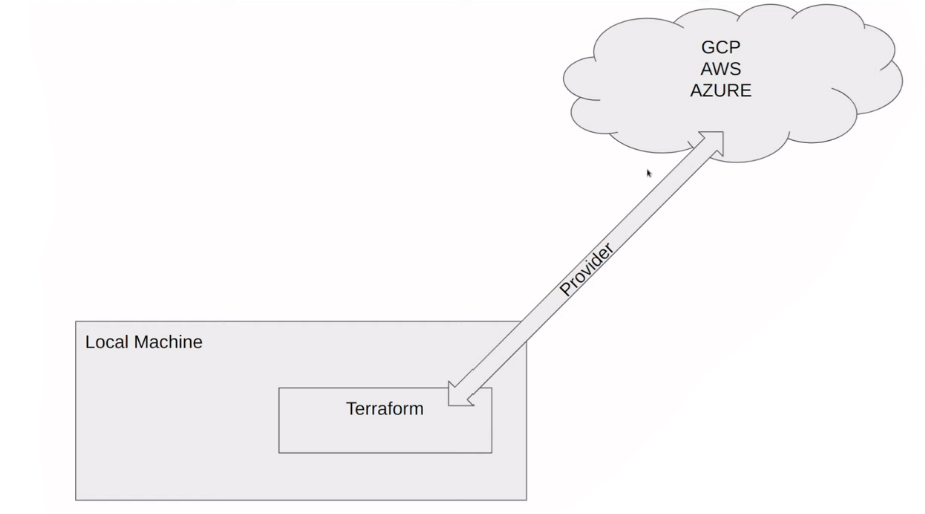

# About

## What is Infrastructure as Code (IaC)?

- Use DevOps methodology and versioning with a descriptive model to define and deploy infrastructure, such as networks, virtual machines, load balancers, and connection topologies.
- An IaC model generates **the same environment every time it deploys.** -> a component for continuous delivery (CD) to **avoid manual configuration** to enforce consistency.
- IaC should use declarative `definition files` if possible. A definition file describes the components and configuration that an environment requires, but not necessarily how to achieve that configuration.

## What is Terraform?

- An infrastructure as code (IaC) tool that lets you define both cloud and on-prem resources in human-readable configuration file that you can version, reuse and share.
  

## Why use Terraform

- Instead of dealing with Infrastructure manually (e.g., logging into provider to create components), you can update all in Terraform code.
  -> keeping track of infrastructure
- Act as human readable blueprints that can execute and automate everything you do in the Cloud.

## Terraform key commands

- `Init`: initializes a working directory containing Terraform configuration files
- `Plan`: What am I about to do? compare the desired state with the existing state to see what resources you are having at the moment
- `Apply`: do what is in the tf files | to provide the resources asked in the plan
- `Destroy`: Remove everything defined in the tf files

## Tutorial

- Step 1: access Google Cloud
- Step 2: go to section `IAM and admin` -> `Service accounts` -> `Create service account` -> Fill in the form -> Add role \
  In our case (i.e., create GCP bucket and BigQuery) -> role `Storage Admin` and role `BigQuery Admin`
- Step 3: create new (JSON) keys for the service
- Step 4: create `main.tf` file
- Step 5: initialize by running

  ```
  terraform init
  ```

- Step 6: check Google Buckets -> go to section `Cloud Storage` -> `Buckets`. Currently, they are empty. -> add code in `main.tf` to manage the resource.

- Step 7: write the resources needed to update in `main.tf`. Then, upload the plan:

  ```
  terraform plan
  ```

- Step 8: apply the changes needed
  ```
  terraform apply
  ```
- Step 9: get rid of the resources
  ```
  terraform destroy
  ```
