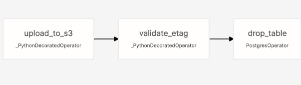

# What is a Data Lake?

- Is a central repo that holds big data from many sources
- Data can be structured, unstructured, semi-structured;
  but the idea is to ingest it as quickly as possible and make it accesible
  to other team members.
- Generally associate some sort of metadata for faster access

|              |                        Data Lake                        |         Data Warehouse         |
| :----------- | :-----------------------------------------------------: | :----------------------------: |
| Data         |                 Unstructured, huge size                 |     Structured, small size     |
| Target users |            Data Scientists or Data Analysts             |       Business Analysts        |
| Use cases    | Stream processing, Machine learning, Real time analysis | Batch processing, BI reporting |
|              |

## How did Data Lake start?

- Companies realized the value of data
- Cannot always define structure of data
- Need for cheap storage of Big Data

# ETL vs ELT

## ETL

- Extract, Transform, Load
- Mainly used for a small amount of data
- Data Warehouse solution

## ELT

- Extract, Load, Transform
- Mainly used for large amounts of data
- Provides Data Lake support (schema on read)


# What is orchestration?

- Is the automated configuration, coordination and management of multiple computer systems, applications and/or services stringing together multiple tasks to execute a larger workflow/process.
- Automates many tasks, to work as a process


<br>
<hr>

# Apache Airflow

## About
- Starts in Airbnb 2014
- Open-source platform for developing, scheduling, and monitoring batch-oriented workflows
- Extends from Python framework
- Including web interface
- Workflow as code

## Installation using Docker

- Step 1: Fetch docker-compose.yaml.

  ```
  curl -LfO 'https://airflow.apache.org/docs/apache-airflow/2.10.4/docker-compose.yaml'
  ```

  You might encounter the error on Windows as such:

  ```
  Invoke-WebRequest : A parameter cannot be found that matches parameter name 'LfO'.
  At line:1 char:6
  + curl -LfO 'https://airflow.apache.org/docs/apache-airflow/2.10.4/dock ...
  +      ~~~~
    + CategoryInfo          : InvalidArgument: (:) [Invoke-WebRequest], ParameterBindingException
    + FullyQualifiedErrorId : NamedParameterNotFound,Microsoft.PowerShell.Commands.InvokeWebRequestCommand
  ```

  **Explanation**: There's a CmdLet called `Invoke-WebRequest` which has an alias of `curl`. So when you execute this command, rather than using curl, it tries to use Invoke-WebRequest. Removing this alias allows you to execute curl as you intended.

  -> **Solution:**

  ```
  curl -Uri 'https://airflow.apache.org/docs/apache-airflow/2.10.4/docker-compose.yaml' -OutFile 'docker-compose.yaml'
  ```

  Step 2: check the [docker-compose.yaml](.\airflow_docker\docker-compose.yaml)

  - in CORE_EXECUTOR: remove CeleryExecutor -> replace with LocalExecutor
  - also remove CeleryResult Backend and CeleryBroker URL.
  - `redis` is neccessary for Celery -> also delete the dependency and definition

  Step 3: initializing the environment

  ```
  mkdir ./dags, ./logs, ./plugins, ./config
  ```

  Step 4: initialize the database <br>
  Initialization to create the first user account:

  ```
  docker compose up airflow-init
  ```

  Step 4: after composing, run `docker-compose up -d` to start the container

  Step 5: access [localhost](http://localhost:8080/) to view the Airflow tasks.

# Airflow Core Concepts
- Workflow is a sequence of tasks, and in Airflow, it is called `DAG - Directed Acyclic Graph`. DAG is your data pipeline and represents a set of instructions that must be completed in a specific order. 
  - Once a task is done, it cannot be returned back to the previous ones. 
- `DAG Dependencies` ensure  that your data tasks are executed in the same order every time, making them reliable for your everyday data infrastructure. 
- The `graphing component of DAGs` allows you to visualize dependencies in Airflow’s user interface.
- `Operators` are the building blocks of Airflow. They contain the logic of how data is processed in a pipeline. 
  - `Action Operators` execute pieces of code. E.g., a Python action operator will run a Python function.
  - `Transfer Operator`: more specialized | to move data from one place to another. 
  - `Sensor Operators` (or `sensors`), are designed to wait for something to happen. E.g., wait for another DAG to finish running. 

When you create an instance of an operator in a DAG and provide it with its required parameters, it becomes a `task`. 
- `Task`: is an instance of an operator. Each task in a DAG is defined by instantiating an operator.


# Airflow Infrastructure Components 
1. `webserver`: Flask server running with Gunicorn serving the UI 
2. `scheduler`: Daemon responsible for scheduling jobs
3. `metastore`: a database where all metadata is stored 
4. `executor`: **defines** how `tasks` are executed 
5. `worker`: process **executing** the tasks, defined by the `executor`
6.  `triggerer`: process running **asyncio** to support deferrable operators
=> The first four components below run at all times,
and the last two are situational components that are used only to run tasks or make use of certain features.