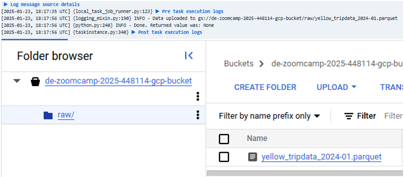
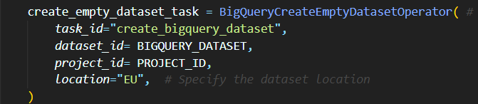
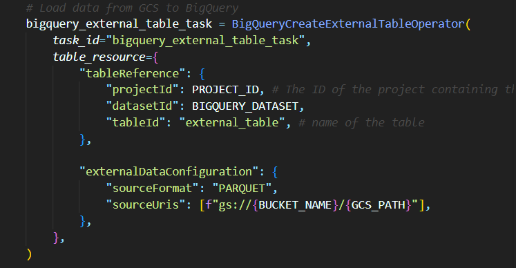

# What is a Data Lake?

- Is a central repo that holds big data from many sources
- Data can be structured, unstructured, semi-structured;
  but the idea is to ingest it as quickly as possible and make it accesible
  to other team members.
- Generally associate some sort of metadata for faster access

|              |                        Data Lake                        |                                        Data Warehouse                                        |
| :----------- | :-----------------------------------------------------: | :------------------------------------------------------------------------------------------: |
| Data         |                 Unstructured, huge size                 | Structured, might have been summarized from on-prem db (OLAP) for faster summary; small size |
| Target users |            Data Scientists or Data Analysts             |                                      Business Analysts                                       |
| Use cases    | Stream processing, Machine learning, Real time analysis |                                Batch processing, BI reporting                                |
|              |

## Transactional Data Lake

- store data at scale
- support transactional operations
- ensure that data is accurate, consistent (ACID)
- allow you to track how data and data structure
  changes over time (ACID)

## How did Data Lake start?

- Companies realized the value of data
- Cannot always define structure of data
- Need for cheap storage of Big Data

# ETL vs ELT

## ETL

- Extract, Transform, Load
- Mainly used for a small amount of data
- Data Warehouse solution

## ELT

- Extract, Load, Transform
- Mainly used for large amounts of data
- Provides Data Lake support (schema on read)

# What is orchestration?

- Is the automated configuration, coordination and management of multiple computer systems, applications and/or services stringing together multiple tasks to execute a larger workflow/process.
- Automates many tasks, to work as a process


<br>
<hr>

# Apache Airflow

## About

- Starts in Airbnb 2014
- Open-source platform for developing, scheduling, and monitoring batch-oriented workflows
- Extends from Python framework
- Including web interface
- Workflow as code

## Installation using Docker

- Step 1: Fetch docker-compose.yaml.

  ```
  curl -LfO 'https://airflow.apache.org/docs/apache-airflow/2.10.4/docker-compose.yaml'
  ```

  You might encounter the error on Windows as such:

  ```
  Invoke-WebRequest : A parameter cannot be found that matches parameter name 'LfO'.
  At line:1 char:6
  + curl -LfO 'https://airflow.apache.org/docs/apache-airflow/2.10.4/dock ...
  +      ~~~~
    + CategoryInfo          : InvalidArgument: (:) [Invoke-WebRequest], ParameterBindingException
    + FullyQualifiedErrorId : NamedParameterNotFound,Microsoft.PowerShell.Commands.InvokeWebRequestCommand
  ```

  **Explanation**: There's a CmdLet called `Invoke-WebRequest` which has an alias of `curl`. So when you execute this command, rather than using curl, it tries to use Invoke-WebRequest. Removing this alias allows you to execute curl as you intended.

  -> **Solution:**

  ```
  curl -Uri 'https://airflow.apache.org/docs/apache-airflow/2.10.4/docker-compose.yaml' -OutFile 'docker-compose.yaml'
  ```

  Step 2: check the [docker-compose.yaml](.\airflow_docker\docker-compose.yaml)

  - in CORE_EXECUTOR: remove CeleryExecutor -> replace with LocalExecutor
  - also remove CeleryResult Backend and CeleryBroker URL.
  - `redis` is neccessary for Celery -> also delete the dependency and definition

  Step 3: initializing the environment

  ```
  mkdir ./dags, ./logs, ./plugins, ./config
  ```

  Step 4: initialize the database <br>
  Initialization to create the first user account:

  ```
  docker compose up airflow-init -d
  ```

  Step 5: to start all services, run:

  ```
  docker compose up
  ```

  Step 6: after have composed, access [localhost](http://localhost:8080/) to view the Airflow tasks.

# Airflow Core Concepts

- Workflow is a sequence of tasks, and in Airflow, it is called `DAG - Directed Acyclic Graph`. DAG is your data pipeline and represents a set of instructions that must be completed in a specific order.
  - Once a task is done, it cannot be returned back to the previous ones.
- `DAG Dependencies` ensure that your data tasks are executed in the same order every time, making them reliable for your everyday data infrastructure.
- The `graphing component of DAGs` allows you to visualize dependencies in Airflow’s user interface.
- `Operators` are the building blocks of Airflow. They contain the logic of how data is processed in a pipeline.
  - `Action Operators` execute pieces of code. E.g., a Python action operator will run a Python function.
  - `Transfer Operator`: more specialized | to move data from one place to another.
  - `Sensor Operators` (or `sensors`), are designed to wait for something to happen. E.g., wait for another DAG to finish running.

When you create an instance of an operator in a DAG and provide it with its required parameters, it becomes a `task`.

- `Task`: is an instance of an operator. Each task in a DAG is defined by instantiating an operator.
  ![alt text]./images/(image-1.png)

# Airflow Infrastructure Components

1. `webserver`: Flask server running with Gunicorn serving the UI
2. `scheduler`: Daemon responsible for scheduling jobs
3. `metastore`: a database where all metadata is stored
4. `executor`: **defines** how `tasks` are executed
5. `worker`: process **executing** the tasks, defined by the `executor`
6. `triggerer`: process running **asyncio** to support deferrable operators

=> The first four components below run at all times,
and the last two are situational components that are used only to run tasks or make use of certain features.

![alt text]./images/(image-3.png)

# Task life cycle

## A happy workflow execution process

![alt text]./images/(image-2.png)

# Our first DAG

## Different operators

- Step 1: Open Aiflow using Docker again.

```
docker compose up airflow-init -d
```

- Step 2: access [localhost:8080](http://localhost:8080/). Since there were automatically loaded DAG examples, we will (temporarily) remove them by opening [docker-compose.yaml file](./airflow_docker/docker-compose.yaml) and set `AIRFLOW__CORE__LOAD_EXAMPLES: "false"`. \
  Then, re-compose Airflow.

- Step 3: Write a `DAG`. Airflow DAG is defined as a Python file under the [dags folder](./airflow_docker/dags/).

#### Note:

- Refer to files containing corresponding operators.
- `upstream task`: directly preceding the other task (parent)
- `downstream task`: direct child of the other task

  E.g., `task1 >> task2` means that task1 is the **upperstream**, which means that task2 can run
  ${\textbf {\textsf{\color{red}ONLY WHEN task1 has succeeded}}}$

# Ingest data to GCP with Airflow

In this section, im gonna show how we can **download a dataset**, **ingest the dataset into Bucket on Google Cloud Platform**, and then **put that dataset to BigQuery for querying (and other operations)**.

## Prerequisites

- Airflow
- Docker
- Google Cloud account

## Complete guide

### Setting up Cloud environment

- Step 1: Access Google Cloud account (create one if you don't have yet)
- Step 2: Create a new project. As you have created a new project, you will also have the `project ID` (which will be used later on).
  ![alt text]./images/(image-4.png)
- Step 3: Navigate to `IAM and admin` -> `Service accounts` -> create a Service Account with role **BigQuery Admin** and **Storage Admin** (since we will be working with Buckets and BigQuery). Additionally, if you want to edit the roles (add, remove, update), go to `IAM and admin` -> `IAM` -> adjust roles.
- Step 4: Add key -> `Create a new key` -> choose the `JSON` option -> Download that file (_that is your credentials_).
- Step 5: in your workspace, put the _Google Credentials_ in such structure: `.google\credentials\google_credentials.json`.
- Step 6: In Google Cloud, create a Bucket: go to Navigation Menu -> `Cloud Storage` -> `Buckets` -> create a new Bucket. Since the name is **globally unique**, I suggest naming as follow: `<project_id> + <the service using>`. For example, my bucket will be `de-zoomcamp-2025-448114-gcp-bucket`.

### Setting up the local environment

Before we dive deep into the actual work, it is always a tedious stuff to set up the initial environment. \
At this step, I am assuming you already known how to use Airflow and run DAGs (if not, refer to [Our first DAG](#our-first-dag)). \
Usually, we can create `.env` file to store our variables in the environment. However, in this case, im gonna define the environment variables straight in `docker-compose.yaml` file.

- Step 1: check [docker-compose.yaml for Airflow](./airflow_docker/docker-compose.yaml).
- Step 2: define additional variables in the environment
  - `GOOGLE_APPLICATION_CREDENTIALS`: the path that leads to `google_credentials.json`
  - `AIRFLOW_CONN_GOOGLE_CLOUD_DEFAULT` (_optional_)
  - `GCP_PROJECT_ID`: the project ID
  - `GCP_GCS_BUCKET`: the name of the bucket

![alt text]./images/(image-5.png)

- Step 3: map corresponding volumes.  
  ![alt text]./images/(image-6.png)

  **Explanation:** `Airflow` is run by using Docker, which means that the **local folders** will have to map to the folders on VM. \
   By default, the official Airflow Docker image sets the home directory to `/opt/airflow`. You can also validate the path by executing

  ```
  docker inspect -f '{{ .Mounts }}' <worker_container_id>
  ```

  To work with folders in Airflow in the terminal, you can execute `bash` environment of the airflow worker:

  ```
  docker exec -it <worker_container_id> bash
  ```

  **How does this volume mapping work?**

  --> General syntax:

  ```
  volumes:
    - [host_path]:[container_path]:[options]
  ```

    - `host_path`: The path to the file or directory on the host machine (your local laptop).
    - `container_path`: The corresponding path inside the Docker container where the volume will be mounted.
    - `options`: (Optional) Access permissions, such as ro (read-only).

      <br>

      ${\textbf {\textsf{\color{red}E.g.,}}}$  `~/.google/credentials/:/.google/credentials:ro`

    - `~/.google/credentials/` (*Host Path*): The directory **on your host machine** where Google Cloud credentials are stored (e.g., your service account JSON files).
        ~ expands to the home directory of the current user.
    - `/.google/credentials` (*Container Path*): The directory **inside the container** where the credentials will be accessible.
    - `ro` (*Option*): Specifies that the volume is read-only, preventing the container from modifying the credentials.

### Writing DAG

Now, we will be writing `DAG` file to execute tasks using Airflow.

- Step 1: import all required libraries and other default args as usual (like normal DAGs)
- Step 2: define environment variables in the file (e.g., `PROJECT_ID = os.environ.get("GCP_PROJECT_ID")`)
- Step 3: define the tasks: download dataset | ingest the dataset into _Google Cloud Storage_ (or **Buckets**) | from GSC load to BigQuery

  ![alt text]./images/(image-8.png)
  <br><br>

  1. **Download the dataset**: we are using `Bash` to execute the downloading command automatically. Initially, we need to specify the URL of the dataset, after which `curl` is used for download and `>` to direct the downloaded file to another place. Since we are running on `Docker`, the _local_ pathby default is `/opt/airflow`. View log in each task to see whether there is any error raised.

  ![alt text]./images/(image-7.png)

  ![alt text]./images/(image-9.png)
  <br>

  2. **Ingest data into Buckets**: this simply uploads the local file to a target location. \
     Refer to [dag_gcp-conect.py](./airflow_docker/dags/dag_gcp-connect.py) for more details.

  

  <br>

  3.  **From Buckets to BigQuery**: As we already had the `parquet` file in Buckets, we will turn this into a `schema` in `BigQuery`. Therefore, before moving the dataset into `BigQuery`, we have to create an **empty dataset** (serves as a placeholder) first, and then can actually load to `BigQuery`.
      <br>
      We can create the empty dataset straight on UI of Google Cloud Platform, however, I will make everything automatic.

  ## 

  

- Step 4: VOILA !!! YOU HAVE DONE !!!
  <br> Now you can go to `BigQuery studio` on GCP to see your new data schema and from here, you can do whatever queries you want to.


# Homework week 2
For the homework this week, we will be working with `Airflow` to ingest the data into `GCS` and then perform the corresponding queries. 
- Dataset used: `Green taxi` dataset from `2021-01-01` to `2021-07-31`
- URL: https://github.com/DataTalksClub/nyc-tlc-data/releases/tag/green/download

## Set up
  

## Questions 
### Question 1