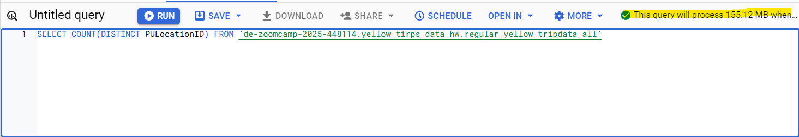

# Set up
- Create the `external` table:
  ```sql
  CREATE OR REPLACE EXTERNAL TABLE `de-zoomcamp-2025-448114.yellow_tirps_data_hw.external_yellow_tripdata_all`
  OPTIONS (
    format = 'parquet',
    uris = ["gs://de-zoomcamp-2025-448114-gcp-bucket-eu/homework/yellow_tripdata_2024-*.parquet"]
  )
  ```
- Create the `regular` table:
  ```sql
  CREATE OR REPLACE TABLE `de-zoomcamp-2025-448114.yellow_tirps_data_hw.regular_yellow_tripdata_all` AS
    SELECT * FROM `yellow_tirps_data_hw.external_yellow_tripdata_all`
  ```

# Question 1
What is count of records for the 2024 Yellow Taxi Data?

  ```sql
  SELECT COUNT(1) 
  FROM `yellow_tirps_data_hw.regular_yellow_tripdata_all`
  ```
- Solution:
  -> `20,332,093`

# Question 2
- Write a query to count the distinct number of PULocationIDs for the entire dataset on **both** the tables.
  - Solution:
    ```sql
    -- For the external table 
    SELECT COUNT(DISTINCT PULocationID) 
    FROM `de-zoomcamp-2025-448114.yellow_tirps_data_hw.external_yellow_tripdata_all`
    
    -- For the regular table 
    SELECT COUNT(DISTINCT PULocationID) 
    FROM `de-zoomcamp-2025-448114.yellow_tirps_data_hw.regular_yellow_tripdata_all`
    ```
- What is the estimated amount of data that will be read when this query is executed on the External Table and the Table?
  - Solution:

  
  -> `0 MB` for the External Table and `155.12 MB` for the Materialized (Regular) Table

# Question 3
Write a query to retrieve the `PULocationID` from the table (not the external table) in BigQuery. Now write a query to retrieve the PULocationID and DOLocationID on the same table. Why are the estimated number of Bytes different? 

-> **Solution:** BigQuery is a columnar database, and it only scans the specific columns requested in the query. Querying two columns (PULocationID, DOLocationID) requires reading more data than querying one column (PULocationID), leading to a higher estimated number of bytes processed.

-> **Solution:** 
  ```sql
  SELECT PULocationID 
  FROM `de-zoomcamp-2025-448114.yellow_tirps_data_hw.regular_yellow_tripdata_all`

  SELECT 
    PULocationID, DOLocationID
  FROM `de-zoomcamp-2025-448114.yellow_tirps_data_hw.regular_yellow_tripdata_all`
  ```


# Question 4
-> Solution: `8333`
  ```sql
  SELECT COUNT(1) 
  FROM `de-zoomcamp-2025-448114.yellow_tirps_data_hw.regular_yellow_tripdata_all`
  WHERE fare_amount = 0
  ```

# Question 5
What is the best strategy to make an optimized table in Big Query if your query will always filter based on `tpep_dropoff_datetime` and order the results by `VendorID` (Create a new table with this strategy)?
- Solution: 
```sql
CREATE OR REPLACE TABLE `de-zoomcamp-2025-448114.yellow_tirps_data_hw.partition_cluster_yellow_tripdata_all`
PARTITION BY date(tpep_dropoff_datetime)
CLUSTER BY VendorID AS 
  SELECT * 
  FROM `de-zoomcamp-2025-448114.yellow_tirps_data_hw.regular_yellow_tripdata_all`
```
-> Partition by tpep_dropoff_datetime and Cluster on VendorID

# Question 6
Write a query to retrieve the distinct VendorIDs between tpep_dropoff_datetime 2024-03-01 and 2024-03-15 (inclusive)

Use the materialized table you created earlier in your from clause and note the estimated bytes. Now change the table in the from clause to the partitioned table you created for question 5 and note the estimated bytes processed. What are these values?

- Solution: 
```sql
-- For non partitioned table:
SELECT DISTINCT(VendorID) 
FROM `de-zoomcamp-2025-448114.yellow_tirps_data_hw.regular_yellow_tripdata_all`
WHERE date(tpep_dropoff_datetime) BETWEEN '2024-03-01' AND '2024-03-15'

-- For partitioned table:
SELECT DISTINCT(VendorID) 
FROM `de-zoomcamp-2025-448114.yellow_tirps_data_hw.partition_cluster_yellow_tripdata_all`
WHERE date(tpep_dropoff_datetime) BETWEEN '2024-03-01' AND '2024-03-15'
```
-> `310.24 MB` for non-partitioned table and `26.84 MB` for the partitioned table

# Question 7
Where is the data stored in the External Table you created?

- Big Query
- Container Registry
- `GCP Bucket` -> solution
- Big Table

# Question 8
It is best practice in Big Query to always cluster your data:

- True
- `False` -> depending on the amount of data; in case only a little data, the compute resources spent on clusters will outweigh the queries.

# Question 9 (optional)
Write a SELECT count(*) query FROM the materialized table you created. 
How many bytes does it estimate will be read? Why?
- Solution:
```sql
SELECT COUNT(*) 
FROM `de-zoomcamp-2025-448114.yellow_tirps_data_hw.regular_yellow_tripdata_all`
```
-> The answer is 0. It is a very efficient query, because it does not have to read contents of the rows; only count the number of rows.