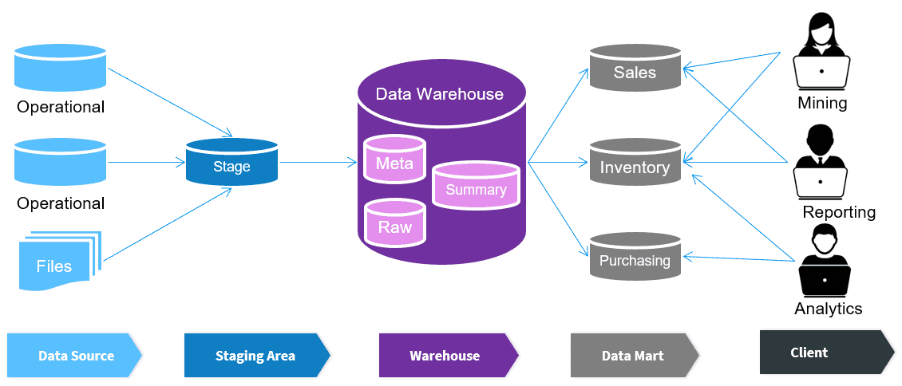
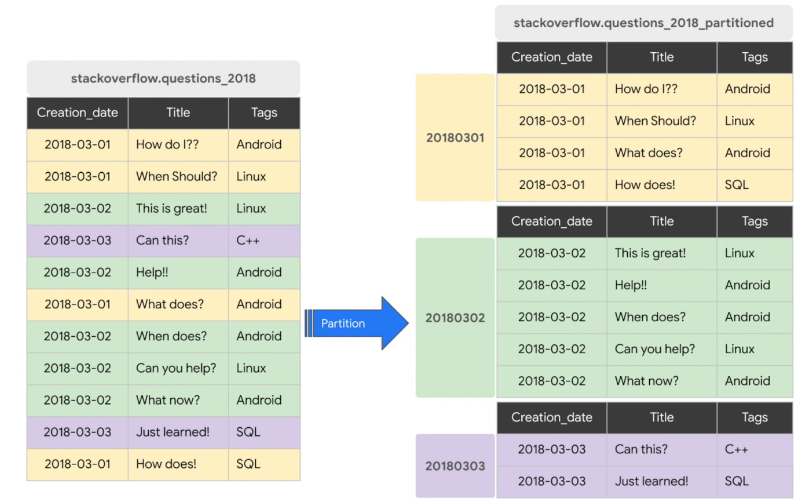
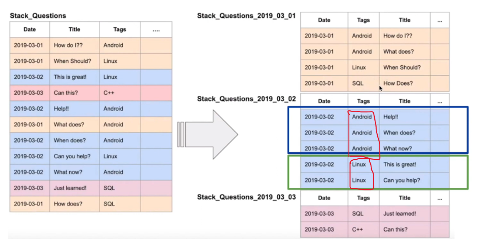

# OLTP vs OLAP

## Comparison

|                    |                OLTP (Online Transaction Processing)                |                                 OLAP (Online Analytical Processing)                                  |
| :----------------- | :----------------------------------------------------------------: | :--------------------------------------------------------------------------------------------------: |
| Purpose            |     Control and run essential business operations in real time     |                  Plan, solve problems, support decisions, discover hidden insights                   |
| Data updates       |               Short, fast updates initiated by users               |                 Data periodically refreshed with scheduled, long-running batch jobs                  |
| Database design    |          **Normalized** database for efficiency analysis           |                               **Denormalized** database for analytics                                |
| Space requirements |           Generally small if historical data is archived           |                          Generally large due to aggregating large datasets                           |
| Data view          |               Lists day-to-day business transactions               |                              Multi-dimensional view of enterprise data                               |
| User examples      | daily bank transactions, e-commerce platforms, reservation systems | Knowledge workers such as DA, BA, and executives; BI and reporting; supply chain management analysis |

<br>

# What is Data Warehouse?

- OLAP solution
- A system that aggregates data from multiple sources into a **single, central and consistent** data store
- Used for reporting and data analysis



# BigQuery

## About

- Severless data warehouse solution (i.e., no servers to manage or database to install) as it takes time and effort to create and maintain a data warehouse.
- Provide software as well as infrastructure (incl. scalability and high availability)
- Maximize flexibility by separating the compute engine that analyzes your data from your storage

## Cost

- On demand pricing: 1TB processed data is 5$
- Flat rate pricing: based on pre-requested slots

## Partitioning

- More efficient when working with partitioned tables as we only need to scan **\*WAY MORE LESS** data than usual
- Time-unit column
- Integer range partitioning
- Number of partition limits is **4000**



- To create partitioned table, use:

  ```
  CREATE OR REPLACE TABLE <table_name>
  PARTITION BY <column_to_be_partitioned>
  ```

  **Example:**

  ```
  CREATE TABLE
    mydataset.newtable (transaction_id INT64, transaction_date DATE)
  PARTITION BY
    transaction_date
    OPTIONS (
      partition_expiration_days = 3,
      require_partition_filter = TRUE);
  ```

## Clustering

- Order of the column is important, because this is the order which specifies **sort order** of the data.
- Clustering improves _filter queries_ and _aggregate queries_.
- Can specify up to 4 clustering columns
- Clustering columns must be **top-level, non-repeated columns**.
  

- To query with clusters, use:

  **Example:**

  ```
  CREATE TABLE mydataset.clustered_table
  (
    customer_id STRING,
    transaction_amount NUMERIC
  )
  CLUSTER BY
    customer_id
  AS (
    SELECT * FROM mydataset.unclustered_table
  );
  ```

## Summary

- `Partitioning`: reduces the **scope of data scanned** by breaking the table into chunks (e.g., by _date_ or _range_).
- `Clustering`: reduces the **amount of work within each chunk** by pre-sorting and organizing rows.
