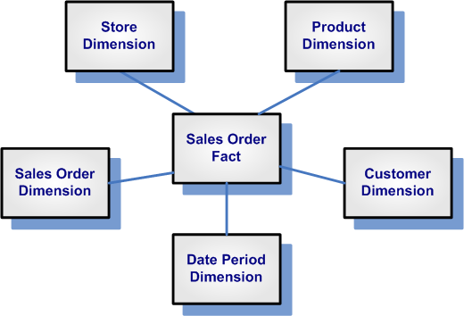
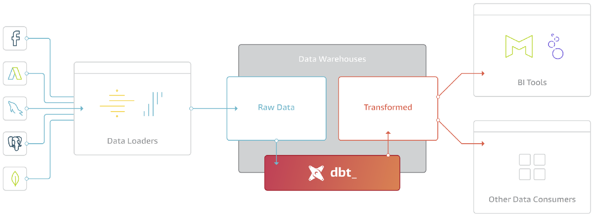
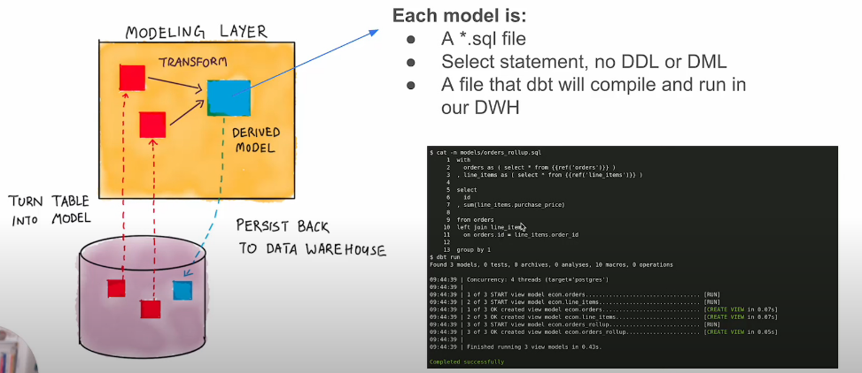
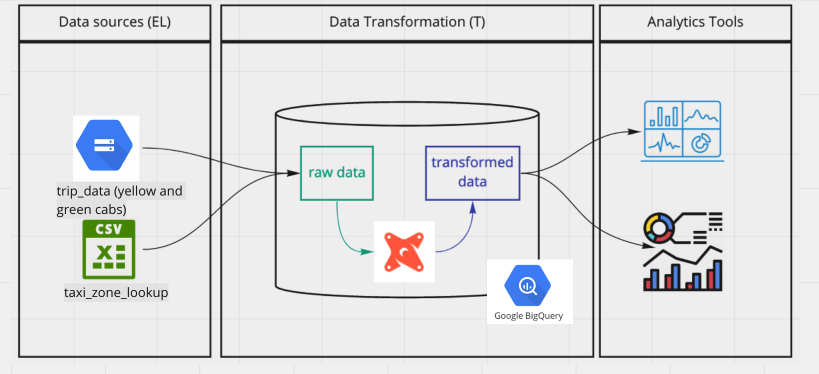
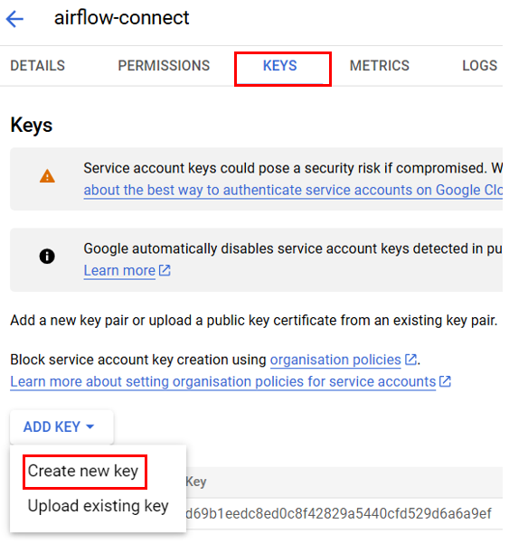
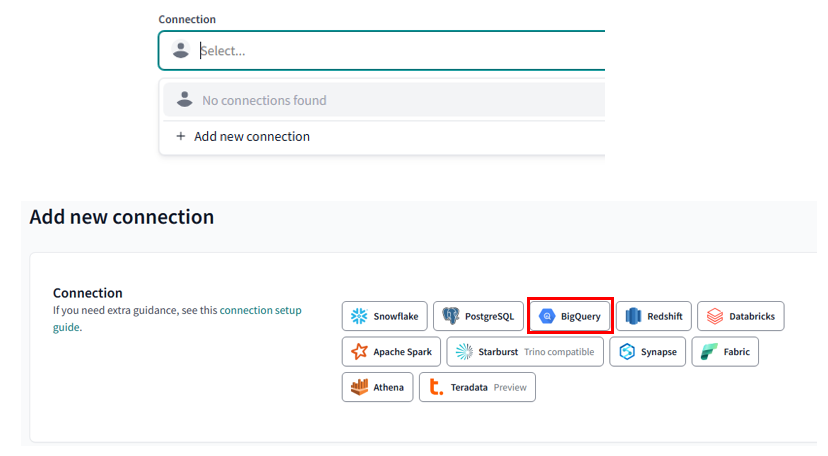
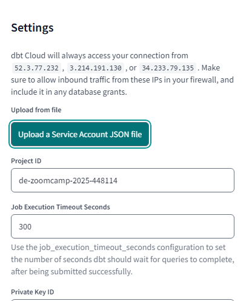
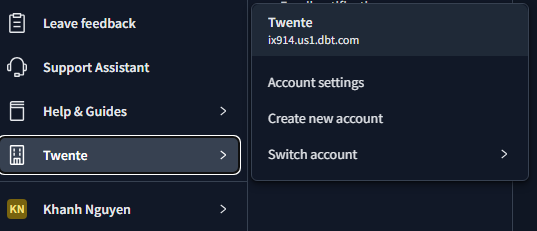
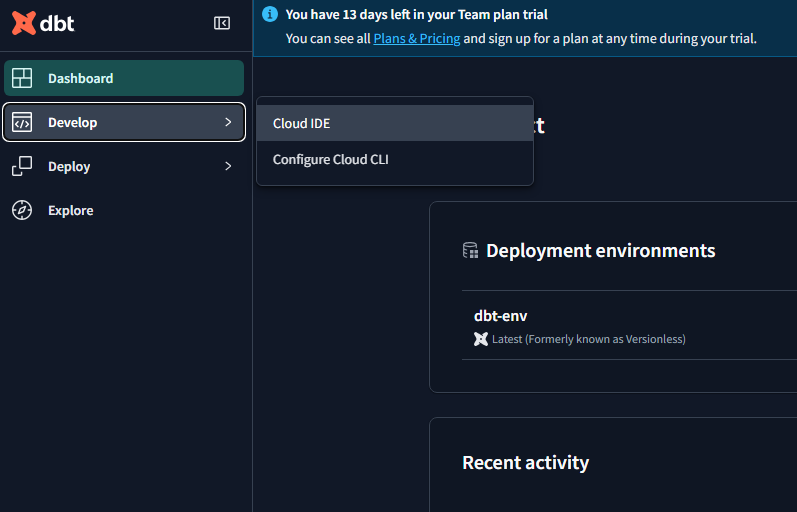
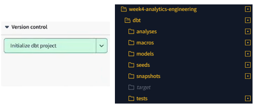

# (Kimball's) Dimensional Modelling

## Objective

- Deliver data understandable to the business users
- Deliver fast query performance

## Approach

Prioritize user understandability and query performance over non-redundant data (3NF).

## Elements of Dimensional Modelling



### Facts tables

- Measurements, metrics or facts
- Correspond to business process
- _verbs_ (e.g., sales, orders, ...)

### Dimensions tables

- Provide context to a business process
- Correspond to a business entity
- _nouns_ (e.g., customers, products, ...)

### Discussion

Dimensional Modeling is built on a **star schema** with fact tables surrounded by dimension tables.

A good way to understand the architecture of Dimensional Modeling is by drawing an analogy between dimensional modeling and a restaurant:

- Stage Area:
  - Contains the raw data.
  - Not meant to be exposed to everyone.
  - Similar to the food storage area in a restaurant.
- Processing area:
  - From raw data to data models.
  - Focuses in efficiency and ensuring standards.
  - Similar to the kitchen in a restaurant.
- Presentation area:
  - Final presentation of the data.
  - Exposure to business stakeholder.
  - Similar to the dining room in a restaurant.

# Intro to `dbt`

## About

- **(data build tool)**
- is a transformation workflow that allows us to _transform_ process raw data in our Data Warehouse to _transformed_ data which can be later used by Business Intelligence tools and any other data consumers.
- Follows SE best practices (e.g., modularity, CI/CD, and documentation) by defining _deployment workflow_:
  - Develop models
  - Test and document models
  - Deploy models with version control and CI/CD.



## How does dbt work?


dbt works by defining a **modeling layer** that sits on top of our Data Warehouse. The modeling layer will turn tables into **models** which we will then transform into _derived models_, which can be then stored into the Data Warehouse for persistence.

A **model** is a .sql file with a `SELECT` statement; no DDL or DML is used. dbt will compile the file and run it in our Data Warehouse.

## Start dbt project

dbt has 2 main components: **dbt Core** and **dbt Cloud**:

- `dbt Core`: open-source project that allows the data transformation.
  - Builds and runs a dbt project (.sql and .yaml files).
  - Includes SQL compilation logic, macros and database adapters.
  - Includes a CLI interface to run dbt commands locally.
  - Open-source and free to use.
- `dbt Cloud`: SaaS application to develop and manage dbt projects.
  - Web-based IDE to develop, run and test a dbt project.
  - Jobs orchestration.
  - Logging and alerting.
  - Intregrated documentation.
  - Free for individuals (one developer seat).

For integration with **BigQuery** we will use the **dbt Cloud IDE** -> local installation of dbt core isn't required.
<br>
Using dbt with a **local Postgres** database can be done with **dbt Core**, which can be installed locally and connected to Postgres and run models through the CLI.


### Setting up Cloud environment

#### Google Cloud Storage setup

- Step 1: Access Google Cloud account (create one if you don't have yet)
- Step 2: Create a **new project**. As you have created a new project, you will also have the **project ID** (which will be used later on).
- Step 3: Navigate to **IAM and admin** -> **Service accounts** -> create a **Service Account** with role **BigQuery Admin** (since we will be working with BigQuery).
  <br> Additionally, if you want to edit the roles (add, remove, update), go to **IAM and admin** -> **IAM** -> adjust roles.
- Step 4: Add key -> Create a new key -> choose the **JSON** option -> Download that file (that is your credentials). <br>
  In case you need to create the key again, just `IAM and admin` -> `Service accounts` -> click on the service account that you want to generate the key -> `Keys` tab -> `Add key`.
  

- Step 5: in your workspace, put the Google Credentials in such structure: `.google\credentials\google_credentials.json`.

#### dbt Cloud project

- Step 1: Go to [dbt](https://www.getdbt.com/pricing) and sign up for the Free developer seat.

- Step 2: Create a project, then set up a database connection -> choose **BigQuery**
  

- Step 3: Upload the `JSON` key file to use the service account.
  

Save the configuration, test the connection and then `Save`.

- Step 4: The last step is to configure **Git repository**. Simply connect to Github and that's done.

  \***\*NOTE:** to edit your project configuration, you can do the following steps: go to the **menu bar** on the left, click on the icon of your **organization** -> choose `Account settings` -> choose `Projects` tab.

  

- Step 5: access the Cloud IDE to use **dbt**.
  

- Step 6: there's a green button saying _"Initialize dbt project"_ -> click it and it'll create necessary files of the project.
  

## Developing with `dbt`

`dbt` uses models written in SQL. E.g.,

```sql
{{
    config(materialized='table')
}}

SELECT *
FROM staging.source_table
WHERE record_state = 'ACTIVE'
```

which will then be compiled into the following code by dbt:

```sql
CREATE TABLE my_schema.my_model AS (
    SELECT *
    FROM staging.source_table
    WHERE record_state = 'ACTIVE'
)
```

- The `config()` function at the beginning of a model to define a **materialization strategy**: a strategy for persisting dbt models in a warehouse.

  - `ephemeral`: temporary and exist only for the duration of a single dbt run (similar to CTE in sql).
  - `view`: are virtual tables created by dbt that can be queried like regular tables.
  - `table`: are physical representations of data that are created and stored in the database | model will be rebuilt as a table on each run.
  - `incremental`: are a powerful feature of dbt that allow for efficient updates to existing tables, reducing the need for **full data** refreshes.

  ## The FROM clause

  - **Sources**:

    - Defines the _sources_ of data to be used.
    - Configuration is defined in `.yml file` in the _models_ folder
    - Source **freshness** can also be defined, which is useful to check whether data pipelines are working properly.

  - **Seeds**:

    - CSV files but stored in our repository.
    - Better version controlling & Equivalent to a copy command
    - Seed usage:

      - Add a CSV file to your `seeds` folder.
      - Run the `dbt seed` command to create a table in our Data Warehouse.

        **Note:** If you update the content of a seed, running `dbt seed` will append the updated values to the table rather than substituing them. Running `dbt seed --full-refresh` instead will drop the old table and create a new one.

      - Refer to the `seed` in your model with the `ref()` function.

  E.g., declare a source in `.yml file`:

  ```sql
  sources:
    - name: staging
      database: production
      schema: trips_data_all

      loaded_at_field: record_loaded_at
      tables:
        - name: green_tripdata
        - name: yellow_tripdata
          freshness:
            error_after: {count: 6, period: hour}
  ```

  And reference a source in a `FROM` clause:

  ```sql
  FROM {{ source('staging','yellow_tripdata') }}
  -- source name and table name respectively
  ```

  <br>

  E.g., in case of using `seeds`, assuming you've got a `taxi_zone_lookup.csv` file in your **seeds** folder which contains `locationid`, `borough`, `zone` and `service_zone`:

  ```sql
  SELECT
    locationid,
    borough,
    zone,
    replace(service_zone, 'Boro', 'Green') as service_zone
  FROM {{ ref('taxi_zone_lookup) }}
  ```

  **Note**: The `ref()` function references underlying tables and views in the Data Warehouse. When compiled, it will automatically **build the dependencies** and **resolve the correct schema** for us. So, if BigQuery contains a schema/dataset called _dbt_dev_ inside the _my_project_ database which we're using for development and it contains a table called _stg_green_tripdata_, then the following code...

  ```sql
  WITH green_data AS (
    SELECT *,
        'Green' AS service_type
    FROM {{ ref('stg_green_tripdata') }}
  )
  ```

  will be compiled to:

  ```sql
  WITH green_data AS (
    SELECT *,
        'Green' AS service_type
    FROM "my_project"."dbt_dev"."stg_green_tripdata"
  ),
  ```

  - If we were to run this code in our _production environment_, dbt would automatically resolve the reference to make it point to our **production schema**.

  ## Defining a source and creating a model

  We will begin by creating 2 new folders under our `models` folder:

  - `staging` will have the raw models.
  - `core` will have the **models** that we will expose at the end to the BI tool, stakeholders, etc.

  Under `staging` we will add 2 new files: `sgt_green_tripdata.sql` and `schema.yml`:

  ```yml
  # schema.yml

  version: 2

  sources:
      - name: staging
        database: your_project
        schema: trips_data_all

        tables:
            - name: green_tripdata
            - name: yellow_tripdata
  ```
  - We define our **sources** in the `schema.yml` model properties file where we define the 2 tables for yellow and green taxi data as our sources.


  ```sql
  -- sgt_green_tripdata.sql
  {{ config(materialized='view') }}

  SELECT * FROM {{ source('staging', 'green_tripdata') }}
  LIMIT 100
  ```

  - This query will create a **view** in the `staging` dataset/schema in our database.
  - We make use of the `source()` function to access the green taxi data table, which is defined inside the `schema.yml` file.

  ## Macros 
  **Macros** are pieces of code in Jinja that can be reused, similar to functions in other languages.

  **dbt** already includes a series of macros like *config()*, *source()* and *ref()*, but custom macros can also be defined.

  **Macros** allow us to add features to SQL that aren't available, such as:
  - Use control structures such as **if** statements or **for** loops.
  - Use environment variables in our **dbt project** for production.
  - Operate on the results of one query to generate another query.
  - Abstract snippets of SQL into reusable macros.

  There are 3 kinds of Jinja delimiters:

  - `` for **statements** (control blocks, macro definitions)
  - `{{ ... }}` for **expressions** (literals, math, comparisons, logic, macro calls...)
  - `{# ... #}` for **comments**.
  
  E.g., a **macro definition**:
  ```jinja
  {# This macro returns the description of the payment_type #}

  

    CASE {{ payment_type }}
        WHEN 1 then 'Credit card'
        WHEN 2 then 'Cash'
        WHEN 3 then 'No charge'
        WHEN 4 then 'Dispute'
        WHEN 5 then 'Unknown'
        WHEN 6 then 'Voided trip'
    end

  
  ```
  - The `macro` keyword states that the line is a macro definition. It includes the name of the macro as well as the parameters.
  - The code of the macro itself goes *between* 2 statement delimiters. The second statement delimiter contains an `endmacro` keyword.
  - In the code, we can access the macro parameters using expression delimiters.
  - The macro returns the **code** we've defined rather than a specific value.

  Here's how we use the **macro**:
  ```sql
  SELECT
    {{ get_payment_type_description('payment_type') }} AS payment_type_description,
    congestion_surcharge::double precision
  FROM {{ source('staging','green_tripdata') }}
  WHERE vendorid IS NOT NULL
  ``` 

  ## Packages 
  Macros can be exported to **packages** (similar to how classes and functions can be exported to libraries in other languages). 
  
  **Packages** contain standalone **dbt projects** with models and macros that tackle a specific problem area.

  When you add a package to your project, the package's models and macros become part of your own project. A list of useful packages can be found in the [dbt package hub](https://hub.getdbt.com/).

  To use a package, you must first create a `packages.yml` file in the **root** of your work directory. Here's an example:
  ```sql
  packages:
  - package: dbt-labs/dbt_utils
    version: 0.8.0
  ```
  In case it has not loaded yet, you can run `dbt deps`.

  ## Variables 
  Variables can be defined in 2 different ways:
  - Under the `vars` keyword inside `dbt_project.yml`.

  ```sql
  vars:
    payment_type_values: [1, 2, 3, 4, 5, 6]
  ```

  - As arguments when building or running on your project.
  ```bash
  dbt build --m <your-model.sql> --var 'is_test_run: false'
  ```

  Variables can also be used with `var()` macro. E.g., 
  ```sql
  

    limit 100

  
  ```

  ## Testing and Documenting `dbt` models
  