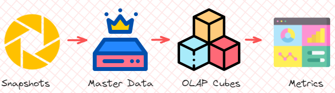

# Analytical Engineering 
### History 
- The term *Analytical Engineer* was first said in mid 2019. 
- Literally analysts that can do a bit of engineering -> has the capacity of an analyst to explain to the stakeholder  

### Roles in a data team 
- Data engineer: prepares and maintain the infrastructure the data team needs
- Data analyst: uses data to answer questions and solve problems 
- Analytics engineer: introduces the good software engineering practices to the efforts of data analysts and data scientists. 

### Tooling
1. Data loading 
2. Data storing: cloud data warehouses like Snowflake, BigQuery, RedShift
3. Data Modelling: Tools like dbt or Dataform 
4. Data Presentation: BI tools like PowerBI, Google Data Studio, Looker, Tableau 

### ETL vs ELT 
- `Extract -> Transform -> Load` 
  - Slightly more stable and compliant data analysis 
  - Higher storage and compute costs 

- `Extract -> Load -> Transform`
  -  Faster and more flexible data analysis 
  - Lower cost and lower maintenance 


# (Kimball's) Dimensional Modelling

### Objective

- Deliver data understandable to the business users
- Deliver fast query performance

### Approach

Prioritize user understandability and query performance over non-redundant data (3NF).

## Elements of Dimensional Modelling (Star Schema)


### Facts tables

- Measurements, metrics or facts
- Correspond to business process
- _verbs_ (e.g., sales, orders, ...)

### Dimensions tables
- Provide context to a business process
- Correspond to a business entity
- _nouns_ (e.g., customers, products, ...)

- Dimensions come into 2 flavors:
  - Slowly changing
  - Fixed 

### Architecture of Dimensional Modelling

A good way to understand the architecture of Dimensional Modeling is by drawing an analogy between dimensional modeling and a restaurant:

- **Stage Area**:
  - Contains the raw data.
  - Not meant to be exposed to everyone.
  - Similar to the food storage area in a restaurant.
- **Processing area**:
  - From raw data to data models.
  - Focuses in efficiency and ensuring standards.
  - Similar to the kitchen in a restaurant.
- **Presentation area**:
  - Final presentation of the data.
  - Exposure to business stakeholder.
  - Similar to the dining room in a restaurant.

Problem: there is data redundancy -> normalization to **snowflake schema**

## Snowflake Schema 
- A star schema is basically a snowflake schema having 1-level hierarchy
- Snowflake schema is more NORMALIZED.


|                    |                Advantages                |                                 Disadvantages                                  |
| :----------------- | :----------------------------------------------------------------: | :--------------------------------------------------------------------------------------------------: |
|           |    Less space (storage cost) thanks to less redundancy  |        More complex                   |
|           |    Less redundant data (easier to maintain/update)     |         More joins (more complex SQL queries)    |
|     |         Solves write slow downs    |  Less performance      Data Marts / Cubes     |
| |

<br>

## OLTP-to-OLAP continuum (4-layer modeling)


1. **Production Database Snapshots** <br>
The starting point is usually OLTP systems. They handle real-time transactions: customer placing an order, transferring money, or updating account details. <br>
However, they are not designed for complex data analysis => This is where **production database snapshots** come into play. These snapshots provide a periodic snapshot of operational data, preserving the state of the system at a given moment. <br>
**Next step:** aggregate those data into a big whole **master data.** 

2. **Master Data** <br>
In the *absence of a **master data layer***, analysts have to work with raw, inconsistent data. Master data provides a single source of truth and organizing data sources. <br>
Imagine, without a unified view of the customer, you end up with fragmented and sometimes contradictory data, which makes it difficult to draw meaningful insights.<br>
In other words, you put everything together in the master data.

3. **OLAP Cubes** <br>
Once we have the master data, we process it through **OLAP cubes**. For example, an OLAP cube might allow a company to analyze sales data by region or product category. <br>
Imagine, from the master data, you split into related chunks by using OLAP cubes

4. **Metrics** <br>
At the end of the continuum, we reach **metrics** — the ultimate output of the entire data pipeline. Whether it’s tracking sales performance, customer behavior, or operational efficiency, these metrics provide the actionable insights that drive business decisions. <br>
In other words, from chunks in the OLAP cubes, you smash into 1 value and that's the metrics.


## Cumulative Table Design
There is a problem when recording user's data: some users only show up occasionally, however, the **master data** must record the full history of those.


# Intro to `dbt`

## What is dbt?

- **(data build tool)**
- is a transformation workflow that allows us to **transform process raw data** in our Data Warehouse to transformed data which can be later used by Business Intelligence tools and any other data consumers.
- Follows SE best practices (e.g., modularity, CI/CD, and documentation) by defining **deployment workflow**:
  - Develop models
  - Test and document models
  - Deploy models with version control and CI/CD.


## How does dbt work?


dbt works by defining a **modeling layer** that sits on top of our Data Warehouse. The modeling layer will turn tables into **models** which we will then transform into _derived models_, which can be then stored into the Data Warehouse for persistence.

A **model** is a .sql file with a `SELECT` statement; no DDL or DML is used. dbt will compile the file and run it in our Data Warehouse.

## About dbt

dbt has 2 main components: **dbt Core** and **dbt Cloud**:

- `dbt Core`: open-source project that allows the data transformation.
  - Builds and runs a dbt project (.sql and .yaml files).
  - Includes SQL compilation logic, macros and database adapters.
  - Includes a CLI interface to run dbt commands locally.
  - Open-source and free to use.
- `dbt Cloud`: SaaS application to develop and manage dbt projects.
  - Web-based IDE to develop, run and test a dbt project.
  - Jobs orchestration.
  - Logging and alerting.
  - Intregrated documentation.
  - Free for individuals (one developer seat).

For integration with **BigQuery** we will use the **dbt Cloud IDE** -> local installation of dbt core isn't required.
<br>
Using dbt with a **local Postgres** database can be done with **dbt Core**, which can be installed locally and connected to Postgres and run models through the CLI.

## dbt setup 
 
### Alternative A: Using dbt Cloud


#### Google Cloud Storage setup

- Step 1: Access Google Cloud account (create one if you don't have yet)
- Step 2: Create a **new project**. As you have created a new project, you will also have the **project ID** (which will be used later on).
- Step 3: Navigate to **IAM and admin** -> **Service accounts** -> create a **Service Account** with role **BigQuery Admin** (since we will be working with BigQuery).
  <br> Additionally, if you want to edit the roles (add, remove, update), go to **IAM and admin** -> **IAM** -> adjust roles.
- Step 4: Add key -> Create a new key -> choose the **JSON** option -> Download that file (that is your credentials). <br>
  In case you need to create the key again, just `IAM and admin` -> `Service accounts` -> click on the service account that you want to generate the key -> `Keys` tab -> `Add key`.
  

- Step 5: in your workspace, put the Google Credentials in such structure: `.google\credentials\google_credentials.json`.

#### dbt Cloud project

- Step 1: Go to [dbt](https://www.getdbt.com/pricing) and sign up for the Free developer seat.

- Step 2: Create a project, then set up a database connection -> choose **BigQuery**
  

- Step 3: Upload the `JSON` key file to use the service account.
  

Save the configuration, test the connection and then `Save`.

- Step 4: The last step is to configure **Git repository**. Simply connect to Github and that's done.

  \***\*NOTE:** to edit your project configuration, you can do the following steps: go to the **menu bar** on the left, click on the icon of your **organization** -> choose `Account settings` -> choose `Projects` tab.

  

- Step 5: access the Cloud IDE to use **dbt**.
  

- Step 6: there's a green button saying _"Initialize dbt project"_ -> click it and it'll create necessary files of the project.
  


### Alternative B: Using local dbt 
#### Local Setup Guide

This guide walks you through setting up a **local analytics engineering** environment using DuckDB and dbt.

<div align="center">

[](https://www.getdbt.com/)
[](https://duckdb.org/)

</div>

>[!NOTE]
>*This guide will explain how to do the setup manually. If you want an additional challenge, try to run this setup using Docker Compose or a Python virtual environment.*

**Important**: All dbt commands must be run from inside the `taxi_rides_ny/` directory. The setup steps below will guide you through:

1. Installing the necessary tools
2. Configuring your connection to **DuckDB**
3. Loading the NYC taxi data
4. Verifying everything works


Step 1: Install DuckDB

`DuckDB` is a fast, **embedded database** that works great for local analytics workloads (OLAP). To install DuckDB, follow the instruction on the [official site](https://duckdb.org/docs/installation) for your specific operating system.

> [!TIP]
> *You can install DuckDB in two ways. You can install the CLI or install the client API for your favorite programming language (in the case of Python, you can use `pip install duckdb`). In this guide, I will install using Docker (duckdb image).*

## Step 2: Install dbt + duckdb
For more information, refer to [Dockerfile.dbt](./Dockerfile.dbt). 

> TL;DR: `Dockerfile.dbt` pulls a **Python** image, then install `dbt-core` and `dbt-adapter` (i.e., `dbt-duckdb`) via:   
```bash
pip install dbt-core # core dbt framework
pip install dbt-duckdb # duckdb adapter for dbt
```

> [!NOTE]
> *If you use dbt core, you will need to install adapters for every single warehouses that you work with.* 


Since we also use `duckdb` as a service, that image is included in [docker-compose.yml](./docker-compose.yaml).

## Step 3: Run the container
Navigate to the folder where **Dockerfile** and **docker-compose.yaml** locate, in the terminal, run `docker compose up -d`.

## Step 4: Check if the services are working
- For dbt, type in terminal: `docker compose exec dbt bash` -> it will lead to the dbt container at working directory (i.e., /usr/app/dbt), then run `dbt --version` to see if it is properly installed. 


To get out the container, type: **exit**.

---

- For duckdb, type in terminal: `docker compose exec duckdb duckdb`. If it runs flawlessly, then you're good to go.


## Step 5: Configure dbt Profile
Run `dbt init taxi_rides_ny` to initialize the project and with the name `taxi_rides_ny`. Then, you need to configure your dbt profile to connect to DuckDB.

### Create or Update `~/.dbt/profiles.yml`

The dbt profile tells dbt how to connect to your database. Update the file `~/.dbt/profiles.yml` with the following content:

```yaml
taxi_rides_ny:
  target: dev
  outputs:
    # DuckDB Development profile
    dev:
      type: duckdb
      path: taxi_rides_ny.duckdb
      schema: dev
      threads: 1
      extensions:
        - parquet
      settings:
        memory_limit: '2GB'
        preserve_insertion_order: false

    # DuckDB Production profile
    prod:
      type: duckdb
      path: taxi_rides_ny.duckdb
      schema: prod
      threads: 1
      extensions:
        - parquet
      settings:
        memory_limit: '2GB'
        preserve_insertion_order: false

# Troubleshooting:
# - If you have less than 4GB RAM, try setting memory_limit to '1GB'
# - If you have 16GB+ RAM, you can increase to '4GB' for faster builds
# - Expected build time: 5-10 minutes on most systems
```

## Step 6: Download and Ingest Data

Now that your dbt profile is configured, let's load the taxi data into DuckDB. Navigate to the dbt project directory and run the ingestion script.

```python
import duckdb
import requests
from pathlib import Path

BASE_URL = "https://github.com/DataTalksClub/nyc-tlc-data/releases/download"

def download_and_convert_files(taxi_type):
    data_dir = Path("data") / taxi_type
    data_dir.mkdir(exist_ok=True, parents=True)

    for year in [2019, 2020]:
        for month in range(1, 13):
            parquet_filename = f"{taxi_type}_tripdata_{year}-{month:02d}.parquet"
            parquet_filepath = data_dir / parquet_filename

            if parquet_filepath.exists():
                print(f"Skipping {parquet_filename} (already exists)")
                continue

            # Download CSV.gz file
            csv_gz_filename = f"{taxi_type}_tripdata_{year}-{month:02d}.csv.gz"
            csv_gz_filepath = data_dir / csv_gz_filename

            response = requests.get(f"{BASE_URL}/{taxi_type}/{csv_gz_filename}", stream=True)
            response.raise_for_status()

            with open(csv_gz_filepath, 'wb') as f:
                for chunk in response.iter_content(chunk_size=8192):
                    f.write(chunk)

            print(f"Converting {csv_gz_filename} to Parquet...")
            con = duckdb.connect()
            con.execute(f"""
                COPY (SELECT * FROM read_csv_auto('{csv_gz_filepath}'))
                TO '{parquet_filepath}' (FORMAT PARQUET)
            """)
            con.close()

            # Remove the CSV.gz file to save space
            csv_gz_filepath.unlink()
            print(f"Completed {parquet_filename}")

def update_gitignore():
    gitignore_path = Path(".gitignore")

    # Read existing content or start with empty string
    content = gitignore_path.read_text() if gitignore_path.exists() else ""

    # Add data/ if not already present
    if 'data/' not in content:
        with open(gitignore_path, 'a') as f:
            f.write('\n# Data directory\ndata/\n' if content else '# Data directory\ndata/\n')

if __name__ == "__main__":
    # Update .gitignore to exclude data directory
    update_gitignore()

    for taxi_type in ["yellow", "green"]:
        download_and_convert_files(taxi_type)

    con = duckdb.connect("taxi_rides_ny.duckdb")
    con.execute("CREATE SCHEMA IF NOT EXISTS prod")

    for taxi_type in ["yellow", "green"]:
        con.execute(f"""
            CREATE OR REPLACE TABLE prod.{taxi_type}_tripdata AS
            SELECT * FROM read_parquet('data/{taxi_type}/*.parquet', union_by_name=true)
        """)

    con.close()
```

This script downloads yellow and green taxi data from 2019-2020, creates the `prod` schema, and loads the raw data into DuckDB. The download may take several minutes depending on your internet connection.

## Step 5: Test the dbt Connection

Verify dbt can connect to your DuckDB database:

```bash
dbt debug
```

## Step 6: Install dbt Power User Extension (VS Code Users)

If you're using Visual Studio Code, install the **dbt Power User** extension to enhance your dbt development experience.

### What is dbt Power User?

dbt Power User is a VS Code extension that provides:

* SQL syntax highlighting and formatting for dbt models
* Inline column-level lineage visualization
* Auto-completion for dbt models, sources, and macros
* Interactive documentation preview
* Model compilation and execution directly from the editor

### Why Not Use the Official dbt Extension?

dbt Labs released an official VS Code extension called [dbt Extension](https://marketplace.visualstudio.com/items?itemName=dbtLabsInc.dbt) powered by the new dbt Fusion engine. However, this extension **requires dbt Fusion** and does not support dbt Core.

Since we're using **dbt Core** with DuckDB for local development, we need the community-maintained **dbt Power User by AltimateAI** extension instead. This extension:

* Works seamlessly with dbt Core (not just dbt Cloud)
* Supports all dbt adapters, including DuckDB
* Is actively maintained and open source
* Provides a rich feature set for local development

### Installation

1. Open VS Code
2. Go to Extensions (Ctrl+Shift+X / Cmd+Shift+X)
3. Search for "dbt Power User"
4. Install **dbt Power User by AltimateAI** (not the dbt Labs version)

Alternatively, install it from the [VS Code Marketplace](https://marketplace.visualstudio.com/items?itemName=innoverio.vscode-dbt-power-user).

> [!NOTE]
> At this point, your local dbt environment is fully configured and ready to use. The next steps (running models, tests, and building documentation) will be covered in the tutorial videos.

## Additional Resources

* [DuckDB Documentation](https://duckdb.org/docs/)
* [dbt Documentation](https://docs.getdbt.com/)
* [dbt-duckdb Adapter](https://github.com/duckdb/dbt-duckdb)
* [NYC Taxi Data Dictionary](https://www.nyc.gov/assets/tlc/downloads/pdf/data_dictionary_trip_records_yellow.pdf)

# Developing with `dbt`

`dbt` uses models written in SQL. E.g.,

```sql
{{
    config(materialized='table')
}}

SELECT *
FROM staging.source_table
WHERE record_state = 'ACTIVE'
```

which will then be compiled into the following code by dbt:

```sql
CREATE TABLE my_schema.my_model AS (
    SELECT *
    FROM staging.source_table
    WHERE record_state = 'ACTIVE'
)
```

- The `config()` function at the beginning of a model to define a **materialization strategy**: a strategy for persisting dbt models in a warehouse.

  - `ephemeral`: temporary and exist only for the duration of a single dbt run (similar to CTE in sql).
  - `view`: are virtual tables created by dbt that can be queried like regular tables.
  - `table`: are physical representations of data that are created and stored in the database | model will be rebuilt as a table on each run.
  - `incremental`: are a powerful feature of dbt that allow for efficient updates to existing tables, reducing the need for **full data** refreshes.

  ## The FROM clause

  - **Sources**:

    - Defines the _sources_ of data to be used.
    - Configuration is defined in `.yml file` in the _models_ folder
    - Source **freshness** can also be defined, which is useful to check whether data pipelines are working properly.

  - **Seeds**:

    - CSV files but stored in our repository.
    - Better version controlling & Equivalent to a copy command
    - Seed usage:

      - Add a CSV file to your `seeds` folder.
      - Run the `dbt seed` command to create a table in our Data Warehouse.

        **Note:** If you update the content of a seed, running `dbt seed` will append the updated values to the table rather than substituing them. Running `dbt seed --full-refresh` instead will drop the old table and create a new one.

      - Refer to the `seed` in your model with the `ref()` function.

  E.g., declare a source in `.yml file`:

  ```sql
  sources:
    - name: staging
      database: production
      schema: trips_data_all

      loaded_at_field: record_loaded_at
      tables:
        - name: green_tripdata
        - name: yellow_tripdata
          freshness:
            error_after: {count: 6, period: hour}
  ```

  And reference a source in a `FROM` clause:

  ```sql
  FROM {{ source('staging','yellow_tripdata') }}
  -- source name and table name respectively
  ```

  <br>

  E.g., in case of using `seeds`, assuming you've got a `taxi_zone_lookup.csv` file in your **seeds** folder which contains `locationid`, `borough`, `zone` and `service_zone`:

  ```sql
  SELECT
    locationid,
    borough,
    zone,
    replace(service_zone, 'Boro', 'Green') as service_zone
  FROM {{ ref('taxi_zone_lookup) }}
  ```

  **Note**: The `ref()` function references underlying tables and views in the Data Warehouse. When compiled, it will automatically **build the dependencies** and **resolve the correct schema** for us. So, if BigQuery contains a schema/dataset called _dbt_dev_ inside the _my_project_ database which we're using for development and it contains a table called _stg_green_tripdata_, then the following code...

  ```sql
  WITH green_data AS (
    SELECT *,
        'Green' AS service_type
    FROM {{ ref('stg_green_tripdata') }}
  )
  ```

  will be compiled to:

  ```sql
  WITH green_data AS (
    SELECT *,
        'Green' AS service_type
    FROM "my_project"."dbt_dev"."stg_green_tripdata"
  ),
  ```

  - If we were to run this code in our _production environment_, dbt would automatically resolve the reference to make it point to our **production schema**.

  ## Defining a source and creating a model

  We will begin by creating 2 new folders under our `models` folder:

  - `staging` will have the raw models.
  - `core` will have the **models** that we will expose at the end to the BI tool, stakeholders, etc.

  Under `staging` we will add 2 new files: `sgt_green_tripdata.sql` and `schema.yml`:

  ```yml
  # schema.yml

  version: 2

  sources:
      - name: staging
        database: your_project
        schema: trips_data_all

        tables:
            - name: green_tripdata
            - name: yellow_tripdata
  ```
  - We define our **sources** in the `schema.yml` model properties file where we define the 2 tables for yellow and green taxi data as our sources.


  ```sql
  -- sgt_green_tripdata.sql
  {{ config(materialized='view') }}

  SELECT * FROM {{ source('staging', 'green_tripdata') }}
  LIMIT 100
  ```

  - This query will create a **view** in the `staging` dataset/schema in our database.
  - We make use of the `source()` function to access the green taxi data table, which is defined inside the `schema.yml` file.

  ## Macros 
  **Macros** are pieces of code in Jinja that can be reused, similar to functions in other languages.

  **dbt** already includes a series of macros like *config()*, *source()* and *ref()*, but custom macros can also be defined.

  **Macros** allow us to add features to SQL that aren't available, such as:
  - Use control structures such as **if** statements or **for** loops.
  - Use environment variables in our **dbt project** for production.
  - Operate on the results of one query to generate another query.
  - Abstract snippets of SQL into reusable macros.

  There are 3 kinds of Jinja delimiters:

  - `` for **statements** (control blocks, macro definitions)
  - `{{ ... }}` for **expressions** (literals, math, comparisons, logic, macro calls...)
  - `{# ... #}` for **comments**.
  
  E.g., a **macro definition**:
  ```jinja
  {# This macro returns the description of the payment_type #}

  

    CASE {{ payment_type }}
        WHEN 1 then 'Credit card'
        WHEN 2 then 'Cash'
        WHEN 3 then 'No charge'
        WHEN 4 then 'Dispute'
        WHEN 5 then 'Unknown'
        WHEN 6 then 'Voided trip'
    end

  
  ```
  - The `macro` keyword states that the line is a macro definition. It includes the name of the macro as well as the parameters.
  - The code of the macro itself goes *between* 2 statement delimiters. The second statement delimiter contains an `endmacro` keyword.
  - In the code, we can access the macro parameters using expression delimiters.
  - The macro returns the **code** we've defined rather than a specific value.

  Here's how we use the **macro**:
  ```sql
  SELECT
    {{ get_payment_type_description('payment_type') }} AS payment_type_description,
    congestion_surcharge::double precision
  FROM {{ source('staging','green_tripdata') }}
  WHERE vendorid IS NOT NULL
  ``` 

  ## Packages 
  Macros can be exported to **packages** (similar to how classes and functions can be exported to libraries in other languages). 
  
  **Packages** contain standalone **dbt projects** with models and macros that tackle a specific problem area.

  When you add a package to your project, the package's models and macros become part of your own project. A list of useful packages can be found in the [dbt package hub](https://hub.getdbt.com/).

  To use a package, you must first create a `packages.yml` file in the **root** of your work directory. Here's an example:
  ```sql
  packages:
  - package: dbt-labs/dbt_utils
    version: 0.8.0
  ```
  In case it has not loaded yet, you can run `dbt deps`.

  ## Variables 
  Variables can be defined in 2 different ways:
  - Under the `vars` keyword inside `dbt_project.yml`.

  ```sql
  vars:
    payment_type_values: [1, 2, 3, 4, 5, 6]
  ```

  - As arguments when building or running on your project.
  ```bash
  dbt build --m <your-model.sql> --var 'is_test_run: false'
  ```

  Variables can also be used with `var()` macro. E.g., 
  ```sql
  

    limit 100

  
  ```

  ## Testing and Documenting `dbt` models
  