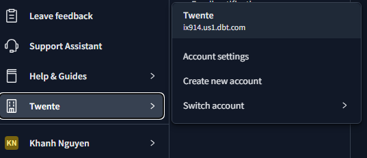

# Intro to `dbt`

## What is dbt?

- **(data build tool)**
- is a transformation workflow that allows us to **transform process raw data** in our Data Warehouse to **transformed data** which can be later used by Business Intelligence tools and any other data consumers.
- defines **deployment workflow**: Develop models | Test and document models | Deploy models with version control and CI/CD.

➡️ You write **SQL (or Python)** to define your transformations, and **dbt** handles the rest: compiling it, running it against the warehouse, managing dependencies, and persisting the results as tables or views.


> In a real company setup, data flows in from all over the place — backend systems, frontend apps, third-party APIs etc ... . All of that gets loaded into warehouse (BigQuery, Snowflake, etc ...), and `dbt` is the layer that **transforms that raw data** into something the **business** can actually **consume**.


## How does dbt work?


dbt works by defining a **modeling layer** that sits on top of our Data Warehouse. The modeling layer will turn tables into **models** which we will then transform into _derived models_, which can be then stored into the Data Warehouse for persistence.

A **model** is a .sql file with a `SELECT` statement; no DDL or DML is used. dbt will compile the file and run it in our Data Warehouse.

# About dbt

dbt has 2 main components: **dbt Core** and **dbt Cloud**:

🏠 `dbt Core`: open-source project that allows the data transformation.
  - Builds and runs a dbt project (**.sql** and **.yaml** files).
  - Includes SQL compilation logic, macros and database adapters.
  - Includes a CLI interface to **run dbt commands locally**.
  - Open-source and free to use.

☁️ `dbt Cloud`: SaaS application to develop and manage dbt projects.
  - **Web-based** IDE to develop, run and test a dbt project.
  - Jobs orchestration.
  - Logging and alerting.
  - Intergrated documentation.
  - Free for individuals (one developer seat).

> For integration with **BigQuery** we will use the **dbt Cloud IDE** -> local installation of dbt core isn't required.
<br>
Using dbt with a **local Postgres** database can be done with **dbt Core**, which can be installed locally and connected to Postgres and run models through the CLI.


# dbt setup

## Alternative A: Using dbt Cloud


### Google Cloud Storage setup

- Step 1: Access Google Cloud account (create one if you don't have yet)
- Step 2: Create a **new project**. As you have created a new project, you will also have the **project ID** (which will be used later on).
- Step 3: Navigate to **IAM and admin** -> **Service accounts** -> create a **Service Account** with role **BigQuery Admin** (since we will be working with BigQuery).
  <br> Additionally, if you want to edit the roles (add, remove, update), go to **IAM and admin** -> **IAM** -> adjust roles.
- Step 4: Add key -> Create a new key -> choose the **JSON** option -> Download that file (that is your credentials). <br>
  In case you need to create the key again, just `IAM and admin` -> `Service accounts` -> click on the service account that you want to generate the key -> `Keys` tab -> `Add key`.
  

- Step 5: in your workspace, put the Google Credentials in such structure: `.google\credentials\google_credentials.json`.

#### dbt Cloud project

- Step 1: Go to [dbt](https://www.getdbt.com/pricing) and sign up for the Free developer seat.

- Step 2: Create a project, then set up a database connection -> choose **BigQuery**
  

- Step 3: Upload the `JSON` key file to use the service account.
  

Save the configuration, test the connection and then `Save`.

- Step 4: The last step is to configure **Git repository**. Simply connect to Github and that's done.

  \***\*NOTE:** to edit your project configuration, you can do the following steps: go to the **menu bar** on the left, click on the icon of your **organization** -> choose `Account settings` -> choose `Projects` tab.

  

- Step 5: access the Cloud IDE to use **dbt**.
  

- Step 6: there's a green button saying _"Initialize dbt project"_ -> click it and it'll create necessary files of the project.    


## Alternative B: Using local dbt

### Local Setup Guide

This guide walks you through setting up a **local analytics engineering** environment using DuckDB and dbt via Docker.

<div align="center">

[](https://www.getdbt.com/)
[](https://duckdb.org/)

</div>

**Important**: The setup steps below will guide you through:

1. Installing the necessary tools
2. Configuring your connection to **DuckDB**
3. Loading the NYC taxi data
4. Verifying everything works

### Step 1: Install dbt + duckdb

For more information, refer to [Dockerfile.dbt](./Dockerfile.dbt).

> TL;DR: `Dockerfile.dbt` pulls a **Python** image, then install `dbt-core` and `dbt-adapter` (i.e., `dbt-duckdb`) via:

```bash
pip install dbt-core # core dbt framework
pip install dbt-duckdb # duckdb adapter for dbt
```

> [!NOTE]
> _If you use dbt core, you will need to install adapters for every single warehouses that you work with._

Since we also use `duckdb` as a service, that image is included in [docker-compose.yml](./docker-compose.yaml).

`DuckDB` is a fast, **embedded database** that works great for local analytics workloads (OLAP). To install DuckDB, follow the instruction on the [official site](https://duckdb.org/docs/installation) for your specific operating system.

> [!TIP]
> _You can install DuckDB in two ways. You can install the CLI or install the client API for your favorite programming language (in the case of Python, you can use `pip install duckdb`). In this guide, I will install using Docker (duckdb image)._

### Step 2: Run the container

Navigate to the folder where **Dockerfile** and **docker-compose.yaml** locate, in the terminal, run `docker compose up -d`.

### Step 3: Check if the services are working

- For `dbt`, type in terminal: `docker compose exec dbt bash` -> it will lead to the dbt container at working directory (i.e., /usr/app/dbt), then run `dbt --version` to see if it is properly installed.


To get out the container, type: **exit**.

---

- For `duckdb`, type in terminal: `docker compose exec duckdb duckdb`. If it runs flawlessly, then you're good to go.


### Step 4: Configure dbt Profile

Run `dbt init taxi_rides_ny` to initialize the project and with the name `taxi_rides_ny`. Then, you need to configure your dbt profile to connect to DuckDB.

#### Create or Update `~/.dbt/profiles.yml`

The dbt profile tells dbt how to connect to your database. Update the file `~/.dbt/profiles.yml` with the following content:

```yaml
taxi_rides_ny:            # -> dbt project name, needs to match exactly 
                          # the profile in dbt_project.yml file
  target: dev             # defines the profile you want to use 
  outputs:
    
    dev:                  # DuckDB Development profile
      type: duckdb        # type of data warehouse you are connecting to
      path: taxi_rides_ny.duckdb
      schema: dev
      threads: 1
      extensions:
        - parquet
      settings:
        memory_limit: "2GB"
        preserve_insertion_order: false

    
    prod:                 # DuckDB Production profile
      type: duckdb
      path: taxi_rides_ny.duckdb
      schema: prod
      threads: 1
      extensions:
        - parquet
      settings:
        memory_limit: "2GB"
        preserve_insertion_order: false

# Troubleshooting:
# - If you have less than 4GB RAM, try setting memory_limit to '1GB'
# - If you have 16GB+ RAM, you can increase to '4GB' for faster builds
# - Expected build time: 5-10 minutes on most systems
```
>[!TIP]
> To check the location of your `profiles.yml` file, you can run `dbt debug --config-dir`. 


### Step 5: Download and Ingest Data

Now that your dbt profile is configured, let's load the taxi data into DuckDB. Navigate to the dbt project directory and run the ingestion script.

```python
import duckdb
import requests
from pathlib import Path

BASE_URL = "https://github.com/DataTalksClub/nyc-tlc-data/releases/download"

def download_and_convert_files(taxi_type):
    data_dir = Path("data") / taxi_type
    data_dir.mkdir(exist_ok=True, parents=True)

    for year in [2019, 2020]:
        for month in range(1, 13):
            parquet_filename = f"{taxi_type}_tripdata_{year}-{month:02d}.parquet"
            parquet_filepath = data_dir / parquet_filename

            if parquet_filepath.exists():
                print(f"Skipping {parquet_filename} (already exists)")
                continue

            # Download CSV.gz file
            csv_gz_filename = f"{taxi_type}_tripdata_{year}-{month:02d}.csv.gz"
            csv_gz_filepath = data_dir / csv_gz_filename

            response = requests.get(f"{BASE_URL}/{taxi_type}/{csv_gz_filename}", stream=True)
            response.raise_for_status()

            with open(csv_gz_filepath, 'wb') as f:
                for chunk in response.iter_content(chunk_size=8192):
                    f.write(chunk)

            print(f"Converting {csv_gz_filename} to Parquet...")
            con = duckdb.connect()
            con.execute(f"""
                COPY (SELECT * FROM read_csv_auto('{csv_gz_filepath}'))
                TO '{parquet_filepath}' (FORMAT PARQUET)
            """)
            con.close()

            # Remove the CSV.gz file to save space
            csv_gz_filepath.unlink()
            print(f"Completed {parquet_filename}")

def update_gitignore():
    gitignore_path = Path(".gitignore")

    # Read existing content or start with empty string
    content = gitignore_path.read_text() if gitignore_path.exists() else ""

    # Add data/ if not already present
    if 'data/' not in content:
        with open(gitignore_path, 'a') as f:
            f.write('\n# Data directory\ndata/\n' if content else '# Data directory\ndata/\n')

if __name__ == "__main__":
    # Update .gitignore to exclude data directory
    update_gitignore()

    for taxi_type in ["yellow", "green"]:
        download_and_convert_files(taxi_type)

    con = duckdb.connect("taxi_rides_ny.duckdb")
    con.execute("CREATE SCHEMA IF NOT EXISTS prod")

    for taxi_type in ["yellow", "green"]:
        con.execute(f"""
            CREATE OR REPLACE TABLE prod.{taxi_type}_tripdata AS
            SELECT * FROM read_parquet('data/{taxi_type}/*.parquet', union_by_name=true)
        """)

    con.close()
```

This script downloads yellow and green taxi data from 2019-2020, creates the `prod` schema, and loads the raw data into DuckDB. The download may take several minutes depending on your internet connection.

### Step 6: Test the dbt Connection

Verify dbt can connect to your DuckDB database:

```bash
dbt debug
```

### *(Optional)* Step 7: Install dbt Power User Extension (VS Code Users)

If you're using Visual Studio Code, install the **dbt Power User** extension to enhance your dbt development experience.

#### What is dbt Power User?

dbt Power User is a VS Code extension that provides:

- SQL syntax highlighting and formatting for dbt models
- Inline column-level lineage visualization
- Auto-completion for dbt models, sources, and macros
- Interactive documentation preview
- Model compilation and execution directly from the editor

#### Why Not Use the Official dbt Extension?

dbt Labs released an official VS Code extension called [dbt Extension](https://marketplace.visualstudio.com/items?itemName=dbtLabsInc.dbt) powered by the new dbt Fusion engine. However, this extension **requires dbt Fusion** and does not support dbt Core.

Since we're using **dbt Core** with DuckDB for local development, we need the community-maintained **dbt Power User by AltimateAI** extension instead. This extension:

- Works seamlessly with dbt Core (not just dbt Cloud)
- Supports all dbt adapters, including DuckDB
- Is actively maintained and open source
- Provides a rich feature set for local development

#### Installation

1. Open VS Code
2. Go to Extensions (Ctrl+Shift+X / Cmd+Shift+X)
3. Search for "dbt Power User"
4. Install **dbt Power User by AltimateAI** (not the dbt Labs version)

Alternatively, install it from the [VS Code Marketplace](https://marketplace.visualstudio.com/items?itemName=innoverio.vscode-dbt-power-user).


# Additional Resources

- [DuckDB Documentation](https://duckdb.org/docs/)
- [dbt Documentation](https://docs.getdbt.com/)
- [dbt-duckdb Adapter](https://github.com/duckdb/dbt-duckdb)
- [NYC Taxi Data Dictionary](https://www.nyc.gov/assets/tlc/downloads/pdf/data_dictionary_trip_records_yellow.pdf)

