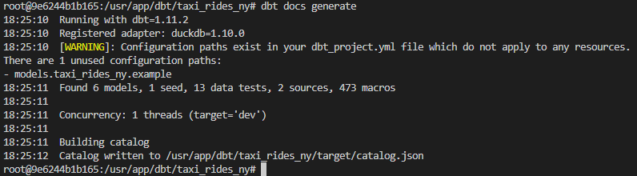

# Developing with `dbt`

## dbt project structure

```py
# structure example

jaffle_shop
├── README.md
├── analyses
├── seeds
│   └── employees.csv
├── dbt_project.yml
├── macros
│   └── cents_to_dollars.sql
├── models
│   ├── intermediate
│   │   └── finance
│   │       ├── _int_finance__models.yml
│   │       └── int_payments_pivoted_to_orders.sql
│   ├── marts
│   │   ├── finance
│   │   │   ├── _finance__models.yml
│   │   │   ├── orders.sql
│   │   │   └── payments.sql
│   │   └── marketing
│   │       ├── _marketing__models.yml
│   │       └── customers.sql
│   ├── staging
│   │   ├── jaffle_shop
│   │   │   ├── _jaffle_shop__docs.md
│   │   │   ├── _jaffle_shop__models.yml
│   │   │   ├── _jaffle_shop__sources.yml
│   │   │   ├── base
│   │   │   │   ├── base_jaffle_shop__customers.sql
│   │   │   │   └── base_jaffle_shop__deleted_customers.sql
│   │   │   ├── stg_jaffle_shop__customers.sql
│   │   │   └── stg_jaffle_shop__orders.sql
│   │   └── stripe
│   │       ├── _stripe__models.yml
│   │       ├── _stripe__sources.yml
│   │       └── stg_stripe__payments.sql
│   └── utilities
│       └── all_dates.sql
├── packages.yml
├── snapshots
└── tests
    └── assert_positive_value_for_total_amount.sql
```

These are the files/folders that are created when you run `dbt init`:

- `analyses`: a place for SQL files that you don't want to expose, generally used for data quality reports. _Not many people use this._

- `dbt_project.yml` _(important)_: this file is needed to run **dbt commands** | tells dbt project-specific configs | for dbt Core, your profile should match the one in the `.dbt/profiles.yml`.

- `macros`: behave like **Python functions** (reusable logic). E.g., calendar conversion, tax rates etc ...

- `seeds`: a place to **upload csv and flat files** (a quick and dirty way to add to dbt later). \
  Not many people use this as we want a more permanent solution that fixes into the database. Only used when you don't have control/permission over the database.

- `snapshots`: are used to capture and version your data at specific points in time. Useful to track the history of a column that overwrites itself.

- `tests`: contains (written) tests to **validate data transformations** - you can write custom tests or use built-in ones to **ensure data quality**. DBT provides built in tests such as: unique, not_null, relationship tests etc ...

- `models`: dbt suggests 3 subfolders (similar to medallion architecture)
  - `staging`: put all of your SQL sources (raw table from database). Additionally, staging files (i.e., 1-to-1 copy of your data with **minimal cleaning step**)
  - `intermediate`: heavy duty cleaning or complex logic
  - `marts`: if it is in marts, then it is ready for consumption (dashboard-ready)

## dbt Sources (defining source and create model)

We will begin by creating 2 new folders under our `models` folder:

- `staging` will have the raw models. Here, we create the source file called `sources.yml` and a `stg_green_tripdata.sql` (as well as `stg_yellow_tripdata.sql`) to create models in our database.

  ```yml
  # sources.yml

  version: 2

  sources:
    - name: raw_data
      description: "raw data for sources for NYC taxi rides"
      database: taxi_rides_ny     # check ingest.py
      schema: prod                # check ingest.py
      tables:
        - name: green_tripdata
        - name: yellow_tripdata

  # We define the 2 tables for yellow and green taxi data as our sources.
  ```

  ```sql
  -- stg_green_tripdata.sql

  {{ config(materialized='view') }}

  SELECT * 
  FROM {{ source('raw_data', 'green_tripdata') }} -- source name and table name respectively
  LIMIT 100 
  
  -- We make use of the `source()` function to access the green taxi data table, which is defined inside the `sources.yml` file.
  ```

  - When you execute the `dbt run` command, dbt will build this model data warehouse by wrapping it in a **create view as** or **create table as** statement. \
  ➡️ create a **view** in the `staging` dataset/schema in our database. \
  ➡️ during the `dbt run`, dbt reads **.sql** files in the models directory, compiles them into executable SQL queries, and runs these queries against your data warehouse to create/update the datasets.

  
  - The `config()` function at the beginning of a model to define a **materialization strategy**: a strategy for persisting dbt models in a warehouse.
    - `ephemeral`: temporary and exist only for the duration of a single dbt run (similar to CTE in sql).
    - `view`: are virtual tables created by dbt that can be queried like regular tables.
    - `table`: are physical representations of data that are created and stored in the database | model will be rebuilt as a table on each run.
    - `incremental`: are a powerful feature of dbt that allow for efficient updates to existing tables, reducing the need for **full data** refreshes.
<!-- - `core` will have the **models** that we will expose at the end to the BI tool, stakeholders, etc. -->


## dbt Seeds && Macros 
`dbt seed` is a way to upload a CSV file and make it available as a **dbt model**. Assume that you've got a `taxi_zone_lookup.csv` file in your **seeds** folder, from terminal at the project root path, run `dbt seed` and it becomes queryable just like any other model.


At this point (after running `dbt seed`), `taxi_zone_lookup` exists as a **dbt model** (i.e., it is brought to the database). If the source of your dbt model is another **dbt model**, you can use `ref` (instead of `source`). 
```sql
-- code snippet that uses `ref` in `dim_zones.sql`
WITH taxi_zone_lookup AS (
  SELECT * FROM {{ ref('taxi_zone_lookup') }}
), 
...
```

---

`dbt Macros` come in handy when you want to define a function that can be reused in your project. In this example, you want to divide into cases where different `vendorid` stand for different `vendor_name`. However, **what happens when a new vendor appears, or a vendor changes its name?** You have to open this file, find the CASE block, and add another line. Too cumbersome!

Therefore, `macros` are here to help. Think of them as **reusable SQL functions**. 

```jinja
{# define the function as a .sql file under \macros folder #}

CASE 
    WHEN {{ vendor_id }} = 1 THEN 'Creative Mobile Technologies, LLC'
    WHEN {{ vendor_id }} = 2 THEN 'VeriFone Inc.'
    ELSE 'Unknown Vendor'
END

```
The `macro` keyword states that the line is a macro definition. It includes the name of the macro as well as the parameters.

> There are 3 kinds of Jinja delimiters:
> - `` for **statements** (control blocks, macro definitions)
> - `{{ ... }}` for **expressions** (literals, math, comparisons, logic, macro calls...)
> - `{# ... #}` for **comments**.

Then, we can simply use that defined function in another **.sql file**. 
```sql
-- use macros in /models/marts/dim_vendors.sql
WITH trips_unioned AS (
  ...
), 
vendors AS (
  SELECT 
    ...,
    {{ get_vendor_name('vendor_id') }} AS vendor_name -- here, refer to macros 
  FROM trips_unioned
)
...
```

## dbt Documentations 
YAML files are primary places to **document your entire project**. The most common convention is to have a single file called `schema.yml` per directory.

### What can you document in dbt?
Almost everything in dbt can be documented. The structure is the same pattern regardless of what you're documenting:

#### Sources
You already have a `sources.yml` — you can add descriptions to the source itself and to each table inside it.

```yml
version: 2

sources:
  - name: raw_data
    description: >
      Raw NYC taxi trip data loaded from BigQuery external tables.
      Contains both yellow and green taxi trip records for 2019-2020.
    database: taxi_rides_ny     
    schema: prod                

    tables:
      - name: green_tripdata
        description: >
          Green taxi trip records. Green taxis operate primarily in
          outer boroughs (outside Manhattan).
          
      - name: yellow_tripdata
        description: Yellow taxi trips, primarily from Manhattan        
```

#### Models
In `schema.yml`, you switch from *sources* to *models*:. Same idea — give each model a name and a description, then drill down into columns.

```yml
version: 2

models:
  - name: dim_zones
    description: >
      Zone lookup table containing LocationID, borough, zone name and service zone.
      One row per taxi zone in NYC.
    columns:
      - name: locationid
        description: Primary key for taxi zones
        tests:
          - unique
          - not_null
      
      - name: borough
        description: NYC borough name (Manhattan, Queens, Brooklyn, Bronx, Staten Island, EWR)
      
      - name: zone
        description: Taxi zone name/neighborhood
      
      - name: service_zone
        description: Service zone type (Yellow, Green, or Airports)
```

#### Columns
Under each model, you can list every column with:

- name — must match the actual column name
- description — what it means
- data_type — what type it should be (informational, not enforced)
- tests — dbt tests
- meta — custom key-value tags

#### Macros and seeds
You can document these too, using the same YAML pattern. 

#### Multi-line descriptions
If you need more than one line for a description, use the YAML **pipe operator (|)** or **greater-than operator (>)**. Everything indented under it becomes part of the description. \
The **>** folds newlines into spaces (except blank lines), while **|** preserves them.

```yml
version: 2

models:
  - name: fct_trips
    description: | # pipe operator will keep the line breaks 
      Fact table containing all taxi trips from both yellow and green taxis.
      
      This is the core analytical table for trip-level analysis.
      Each row represents a single trip with:
      - Trip identifiers and service type
      - Pickup and dropoff locations and timestamps
      - Trip details (distance, passenger count, etc.)
      - Payment information and amounts
      
      Data is filtered for 2019-2020 only and excludes records
      with unknown pickup or dropoff locations.
```

#### Meta tags — custom metadata
The `meta` field lets you attach arbitrary key-value pairs to any column or model. There's no predefined set — you and your team decide what matters. Common examples:

- `PII` — flag columns that contain personally identifiable information
- `owner` — who's responsible for this data asset, who to contact if something breaks
- `importance` — mark which columns or models are critical vs. informational
These don't affect how dbt runs anything. They're purely for governance, discoverability, and helping your team navigate the project.

### Generate and View docs 
Two commands, run them in order:

- `dbt docs generate`: Compiles everything — your YAML descriptions, your model code, and metadata from the warehouse (like actual column types and table sizes) — into a JSON file

  

- `dbt docs serve`: 
  - Takes the generated JSON and spins up a local website *(defaults to localhost:8080)*
  - Only needed if you're on **dbt Core** — dbt Cloud hosts the docs for you
  - If you want other people to see it, you'll need to host it somewhere (S3, Netlify, etc.)

  Since I am working with Docker containers, I mapped the ports as **8081:8080** in dbt services in `docker-compose.yaml`. This means what exported in **port 8080** in Docker container will be mapped to **port 8081** in my local machine.\
  So, I run `docker compose exec dbt bash` to get into dbt container, then `dbt docs serve --host 0.0.0.0 --port 8080`. *Host 0.0.0.0 is binded so that we can access from any network interfaces, and generated docs will be accessible via port 8080 in the container*. 
  
  > Since I already mapped the ports, now the generated docs can be accessed via `localhost:8081` in my local machine. 

  

  

## dbt Tests 
In dbt, there are several types of testing:

### Singular tests 
A **singular data test** is testing in its simplest form: If you can write a SQL query that **returns failing rows**, you can save that query in a **.sql** file within your **test** directory. It's now a data test, and it will be executed by the `dbt test` command.

```sql
-- tests/assert_positive_fare_amount.sql
-- Fare amounts should always be positive

SELECT
    tripid,
    fare_amount
FROM {{ ref('fct_trips') }}
WHERE fare_amount <= 0
```

### Source Freshess tests 
These live in your `source.yaml`, not in a separate file.\
➡️ You add a `freshness` block to a source and tell dbt which column indicates when data was last loaded. Then you run `dbt source freshness` and dbt checks whether that timestamp is recent enough.

You can set both `warn_after` and `error_after` thresholds — one to flag it, one to actually fail.

```yml
version: 2

sources:
  - name: staging
    ...
    tables:
      - name: green_tripdata
        loaded_at_field: lpep_pickup_datetime
        freshness:
          warn_after: {count: 6, period: hour}
          error_after: {count: 12, period: hour}
      
      ...
```

### Generic tests *(common)*
Generic tests are defined in your `.yaml` right alongside your column descriptions. They're parameterized and reusable, so you write the logic once and apply it across as many columns and models as you need.

dbt ships with exactly four:

- `unique` — no duplicate values in this column
- `not_null` — no nulls allowed
- `accepted_values` — column values must be within a defined list
- `relationships` — every value in this column must exist in another model (referential integrity)

```yml
version: 2

models:
  - name: stg_green_tripdata
    description: Staged green taxi data
    columns:
      - name: tripid
        description: Primary key for trips
        data_tests:
          - unique
          - not_null
      
      - name: payment_type
        description: Payment method code
        data_tests:
          - accepted_values:
              values: [1, 2, 3, 4, 5, 6]
      
      - name: pickup_locationid
        description: Taxi zone where trip started
        tests:
          - relationships:
              to: ref('taxi_zone_lookup')
              field: locationid
```

### Custom Generic tests 
You can write your own — they're **.sql files** that live in `tests/generic/`. The syntax uses **Jinja** test blocks, and dbt will pick them up and make them available just like the built-ins.

> A generic data test is defined in a `test` block, which contains a **parametrized query** and **accepts arguments**.

```jinja
{# tests/generic/test_positive_values.sql #}



SELECT *
FROM {{ model }}
WHERE {{ column_name }} < 0


```

```yml
# Usage in `schema.yml`
models:
  - name: fct_trips
    columns:
      - name: fare_amount
        tests:
          - positive_values
      
      - name: trip_distance
        tests:
          - positive_values
```

>[!NOTE]
> You probably don't need to write as many custom tests as you'd expect. The **dbt community** has already built a ton of them in open-source packages (dbt-utils, dbt-expectations, etc.). Worth checking those before rolling your own.

### Unit tests 
Available from dbt v1.8 onwards (released in mid-2024). Unit tests let you test your **SQL logic** in isolation, without hitting the warehouse with real data.

💡 The idea: you define a small set of **mock input rows** and the expected output rows \
➡️ dbt runs your model's SQL against those mocks and checks whether the output matches what you said it should be. 

```yml
# /models/staging/stg_green_tripdata_tests.yml
version: 2

unit_tests:
  - name: test_payment_type_mapping
    description: Test that payment type codes map to correct descriptions
    model: stg_green_tripdata
    given:
      - input: ref('stag_green_tripdata')
        format: dict
        rows:
          - {tripid: '1', payment_type: 1}
          - {tripid: '2', payment_type: 2}
          - {tripid: '3', payment_type: 5}
    expect:
      rows:
        - {tripid: '1', payment_type_description: 'Credit card'}
        - {tripid: '2', payment_type_description: 'Cash'}
        - {tripid: '3', payment_type_description: 'Unknown'}
```
> Unit tests are defined in YAML in your `models/directory`, and currently only support SQL models.
They're particularly useful in CI/CD pipelines where you want to catch logic errors before they hit production data.

📖 Read more about [unit testing here](https://docs.getdbt.com/docs/build/unit-tests).

### Model contracts
⚠️ For some models, constantly changing the shape of its returned dataset poses a risk when other people and processes are querying that model. It's better to define a set of upfront "guarantees" that define the **shape of your model**.\
➡️ We call this set of guarantees a `contract`. It prevents your model from building at all if **the model's transformation** doesn't produce a dataset **matching up** with the contract. 

✅ To enforce a model's contract, set `enforced: true` under the contract configuration.
When enforced, your contract **MUST** include every **column's name** and **data_type** (where **data_type** matches one that your data platform understands).

```yml
version: 2

models:
  - name: fct_trips
    config:
      contract:
        enforced: true
    columns:
      - name: tripid
        data_type: string
        constraints:
          - type: not_null
          - type: unique
      
      - name: pickup_datetime
        data_type: timestamp
        constraints:
          - type: not_null
```

> The idea behind this comes from the concept of `data contracts` — you sit down with your stakeholder, agree on what the output dataset should look like (column names, types, freshness expectations), and the contract **enforces that agreement** automatically. If someone changes the model in a way that breaks it, they'll know immediately.

📖 Read more about [model contracts here](https://docs.getdbt.com/docs/mesh/govern/model-contracts).

## dbt Packages

**Packages** contain standalone **dbt projects** with models and macros that tackle a specific problem area.

When you add a package to your project, the package's models and macros become part of your own project. A list of useful packages can be found in the [dbt package hub](https://hub.getdbt.com/).

To use a package, you must first create a `packages.yml` file in the **root** of your work directory. Here's an example:

```yml
packages:
- package: dbt-labs/dbt_utils
  version: 1.1.1
```

In case it has not loaded yet, you can run `dbt deps` to download and install the package. After it runs, two things appear:

- A `package-lock.yml` file — contains **a hash** of exactly what was installed. Commit this to version control so everyone on your team gets the same versions.
- A `dbt_packages/` directory — this is where the installed package code lives. It's git-ignored by default.

> - When you run `dbt deps`, dbt installs packages based on the versions locked in the `package-lock.yml`. This means that as long as your packages file hasn’t changed, the **exact same dependency versions** will be installed even if newer versions of those packages have been released.
> - If the `packages.yml` file has changed *(i.e., a new package is added or a version range is updated)*, then `dbt deps` automatically resolves the new set of dependencies and **updates the lock file** accordingly.

```sql
-- before
SELECT
    -- Manual concatenation approach
    concat(
        CAST(vendorid as STRING), '-',
        CAST(lpep_pickup_datetime as STRING)
    ) as tripid,
    vendorid,
    pickup_datetime
FROM {{ source('raw_data', 'green_tripdata') }} 


-- after (using package)
SELECT
    {{ dbt_utils.generate_surrogate_key(['vendorid', 'lpep_pickup_datetime']) }} AS tripid,
    vendorid,
    pickup_datetime
FROM {{ source('raw_data', 'green_tripdata') }}
```

📖 Read more about [dbt Packages](https://docs.getdbt.com/docs/build/packages) and [dbt deps command](https://docs.getdbt.com/reference/commands/deps).
