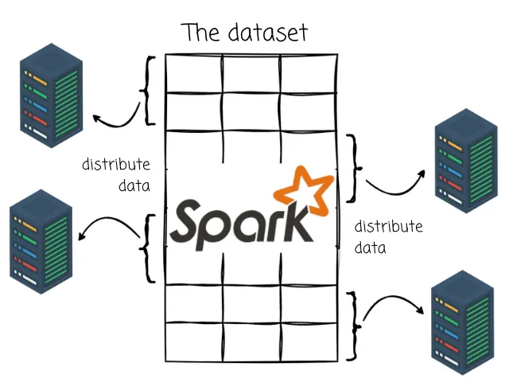
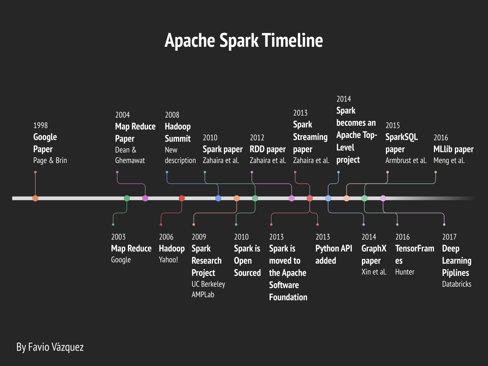
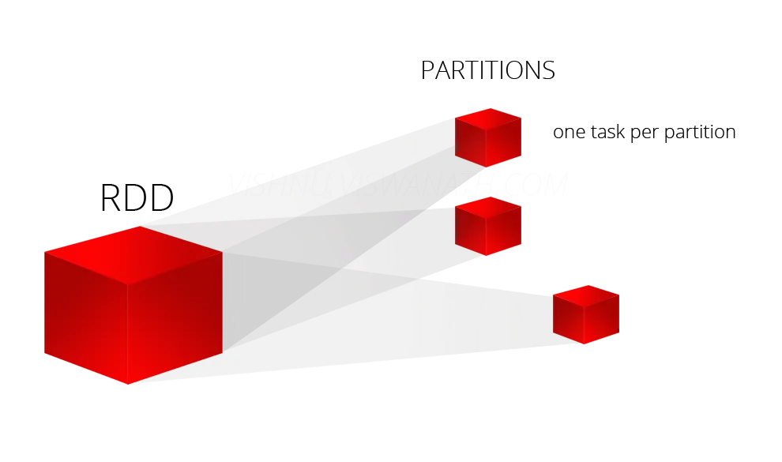

# Apache Spark

## About

- an open-source distributed computing system
- quickly process large volumes of data that can hardly accomplished by operating on a single machine.
- distributes data and computations across multiple machines

## Why was Spark created?

ML algo might need to make many passes over the data, thus building large applications (especially for ML tasks requiring multiple data passes) was difficult

-> the Spark team created a functional programming-based API to simplify multistep applications and developed a new engine for efficient in-memory data sharing across computation steps.

Moreover, sometimes you cannot express the jobs with SQL (maybe your code becomes too difficult to manage) -> use `Spark`.

## SparkSQL 
### History

Researchers were looking for a way to speed up processing jobs in **Hadoop** systems. It is based on Hadoop `MapReduce` and it extends the `MapReduce` model to efficiently use it for more types of computations, which includes interactive queries and stream processing. Spark provides native bindings for the Java, Scala, Python, and R programming languages.

### Apache Spark
Spark was intended to focus more on a general-purpose cluster computing engine than a specified database’s query engine.

`Spark Core` is the heart of Apache Spark and it is responsible for providing distributed task transmission, scheduling, and I/O functionality. The `Spark Core` engine uses the concept of a **Resilient Distributed Dataset (RDD)** as its basic data type. 

>
*Resilient Distributed Datasets (RDD)* is a fundamental data structure of Spark. It is an immutable distributed collection of objects. Each datasets in RDD is divided into **logical partitions**, which may be computed on different nodes of the cluster. 

The RDD is designed so it will hide most of the computational complexity from its users. Spark is intelligent on the way it operates on data; data and partitions are aggregated across a server cluster, where it can then be computed and either moved to a different data store or run through an analytic model. 
