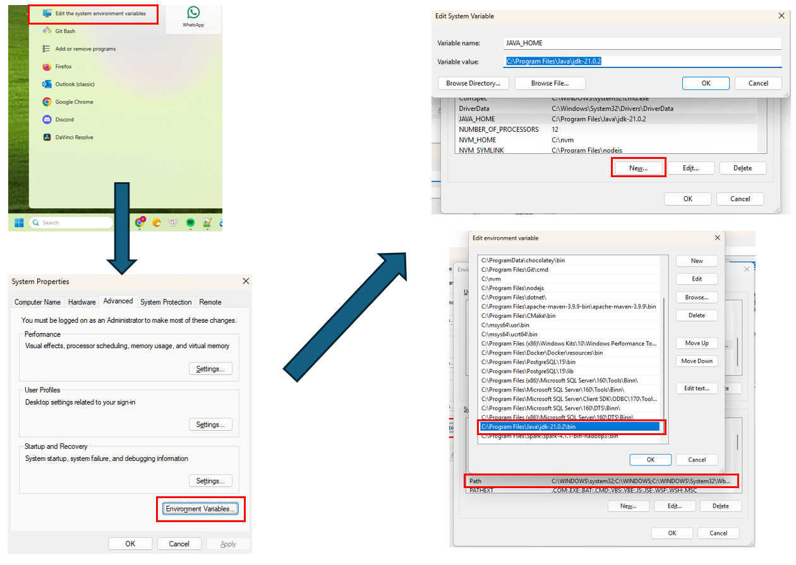
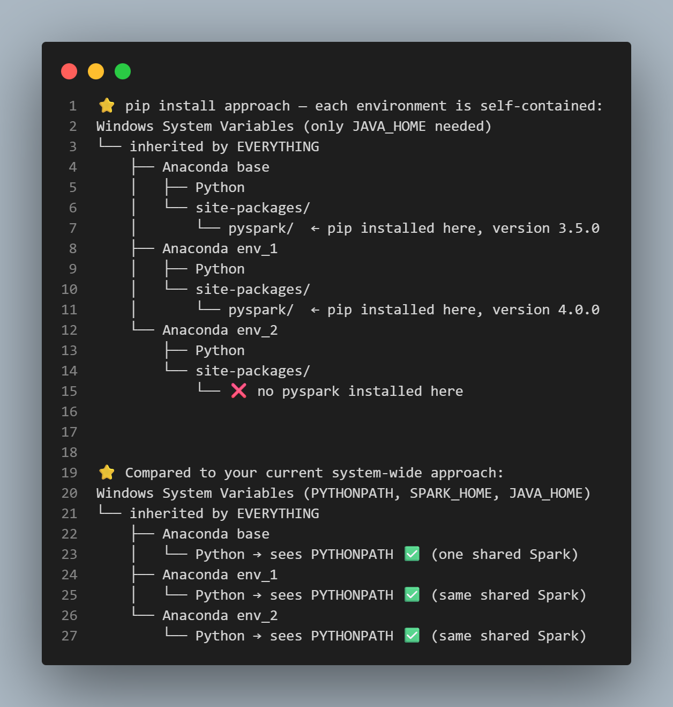

# Spark Installation on Windows

## [Requirements](https://spark.apache.org/docs/4.1.1/)

Spark runs on both Windows and UNIX-like systems (e.g. Linux, Mac OS), and it should run on any platform that runs a supported version of **Java**.

For `Spark 4.1.1`:

- Java 17/21 or Scala 2.13
- Python 3.10+

To run the Unix commands, I already had `msys64` installed. For more information, refer to [msys2](https://www.msys2.org/).

## Install Java

### 1. Download JDK

> _You might need to **run as administrator** to operate these commands._
>
> **Just my personal preference:** I would store everything under `C:/Program Files/Java`, so eventually I will move everything to that path.

We will download from [`OpenJDK`](https://openjdk.org/projects/jdk/). Since JDK 21 has been superseded, visit [OpenJDK Archive](https://jdk.java.net/archive/) to download.

Download the version `21.0.2 for Windows` (https://download.java.net/java/GA/jdk21.0.2/f2283984656d49d69e91c558476027ac/13/GPL/openjdk-21.0.2_windows-x64_bin.zip) or follow the steps below:

```bash
wget https://download.java.net/java/GA/jdk21.0.2/f2283984656d49d69e91c558476027ac/13/GPL/openjdk-21.0.2_windows-x64_bin.zip
```

```bash
unzip openjdk-21.0.2_windows-x64_bin.zip
```

```bash
mkdir "C:\Program Files\Java" && mv jdk-21.0.2 "C:\Program Files\Java" && rm -rf openjdk-21.0.2_windows-x64_bin.zip
```

### 2. Add into environment variables

#### Via Windows GUI



- From the `Search Bar` -> `Edit the system environment variables` -> `Advanced` tab -> `Environment Variables`.

- Set the system variable `JAVA_HOME` to be the path to `JDK folder` and edit system variable `Path` to include the path that leads to `JDK binary` folder.

#### Via terminal _(not recommended)_

> ⚠️⚠️⚠️ **WARNING**: This solution may be destructive to your PATH, and the stability of your system. As a side effect, it will merge your user and system PATH, and truncate PATH to 1024 characters. The effect of this command is irreversible. Make a backup of PATH first. See the comments for more information.
>
> Don't blindly copy-and-paste this. Use with caution.

`/M flag` is for the `system` environment, otherwise `user`.

```bash
setx /M JAVA_HOME "C:\Program Files\Java\jdk-21.0.2"

setx /M path "%path%;C:\Program Files\Java\jdk-21.0.2\bin"
```

### 3. Testing

```
java --version
```

should output the Java version.

## Install Spark

> _You might need to **run as administrator** to operate these commands._
>
> **Again my personal preference:** I would store everything under `C:/Program Files/Spark`, so eventually I will move everything to that path.

Same procedure as in **Installing Java**.

Go to [`Apache Spark`](https://spark.apache.org/downloads.html) page, choose a Spark release (`4.1.1`) and download `.tgz` file.

Terminal commands are as follows:

```bash
wget https://dlcdn.apache.org/spark/spark-4.1.1/spark-4.1.1-bin-hadoop3.tgz
```

```bash
tar -xzvf spark-4.1.1-bin-hadoop3.tgz
```

```bash
mkdir "C:\Program Files\Spark" && mv spark-4.1.1-bin-hadoop3 "C:\Program Files\Spark" && rm -rf spark-4.1.1-bin-hadoop3.tgz
```

### 2. Add into environment variables

Same as setting in [Setting Java environment variables](#install-java).

- Set the system variable `SPARK_HOME` to be the path to `C:\Program Files\Spark\spark-4.1.1-bin-hadoop3`.
- Edit system variable `Path` to include `C:\Program Files\Spark\spark-4.1.1-bin-hadoop3\bin`.

---

### 3. Testing

Run in terminal `spark-shell`, then run

```scala
val data = 1 to 10000
val distData = sc.parallelize(data)
distData.filter(_ < 10).collect()
```

should output

```scala
val res1: Array[Int] = Array(1, 2, 3, 4, 5, 6, 7, 8, 9)
```

## Setup PySpark

_(I will assume you already had Python installed)_.

> In this demo, I'm using VSCode to create Python Notebooks.
>
> Regarding Python, I had `Anaconda` manage all the `Python-related` packages **(all in one)**.

Since we have already installed `Java` and `Spark`, now we need to configure such that `Python` knows where to find `PySpark` from the Spark installation itself (to be specific, set `PYTHONPATH`).

- Set the system variable `PYTHONPATH` to include the path to `C:\Program Files\Spark\spark-4.1.1-bin-hadoop3\python` and `C:\Program Files\Spark\spark-4.1.1-bin-hadoop3\python\lib\py4j-0.10.9.9-src.zip`.

### Testing

Now, create a notebook `.ipynb` and run the following:

```python
import pyspark
from pyspark.sql import SparkSession

spark = SparkSession.builder \
    .master("local[*]") \
    .appName('test') \
    .getOrCreate()

print(f"Spark version: {spark.version}")

df = spark.range(10)
df.show()

spark.stop()
```

It should run and output the result.

---

### What does PYTHONPATH do?

By default, when Python sees `import pyspark`, it searches for the `pyspark` package in these locations in order:

```
1. Current directory
2. Standard library folders
3. Site-packages (where pip installs things)
4. Folders listed in PYTHONPATH
```

Since we didn't use `pip install`, PySpark is **not in site-packages**. So without `PYTHONPATH`, Python simply can't find it and throws:

```
ModuleNotFoundError: No module named 'pyspark'
```

By setting `PYTHONPATH` to point to Spark's Python folder, you're essentially telling Python:

> "Hey, also look in this folder when someone tries to import something"

So Python finds PySpark directly from your Spark installation.

> You can check all the paths that Python searches for via this code snippet:

```py
import sys
print(sys.path)
```

### What is py4j and why is it also in the PYTHONPATH?

PySpark works like this under the hood:

```
Your Python code
      ↓
    py4j          ← bridge between Python and Java
      ↓
  Spark (Java)    ← the actual Spark engine
```

`py4j` is the **bridge library** that lets Python talk to Java. Without it in the path, PySpark can import but immediately fails when trying to actually connect to Spark.

---

### pip install pyspark vs manual setup

This is a really important difference:

**`pip install pyspark`:**

- pip downloads PySpark **bundled with its own Spark**
- No need to download Spark separately
- PySpark version and Spark version are automatically matched
- **Still needs Java/JAVA_HOME though!**
- Quickest way to get started

**Manual setup (what you're doing):**

- You control exactly which Spark version is used
- Better for production or cluster environments
- Useful when Spark is shared across multiple projects/users
- More configuration but more control

---

**Summary table:**

|                         | pip install pyspark    | Manual setup                              |
| ----------------------- | ---------------------- | ----------------------------------------- |
| Need to download Spark? | ❌ No                  | ✅ Yes                                    |
| Need Java?              | ✅ Yes                 | ✅ Yes                                    |
| Need PYTHONPATH?        | ❌ No                  | ✅ Yes                                    |
| Need SPARK_HOME?        | ❌ No                  | ✅ Yes                                    |
| Best for                | Quick start, local dev | Production, clusters, shared environments |


