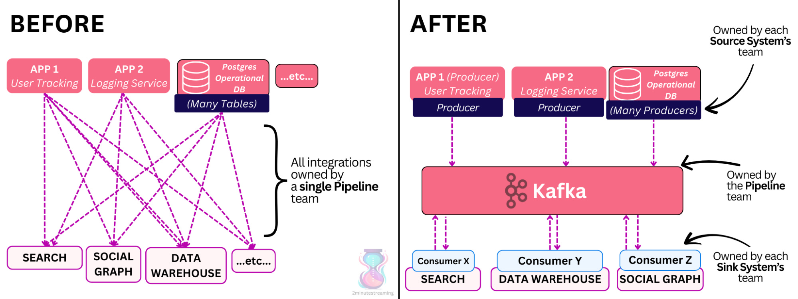
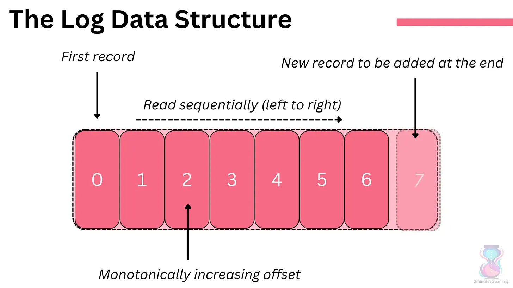
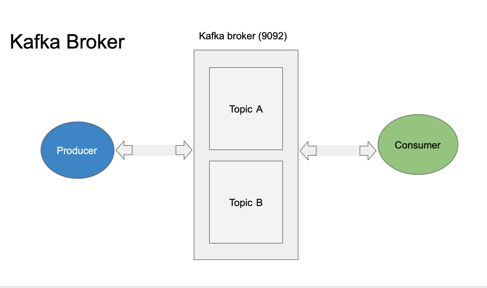
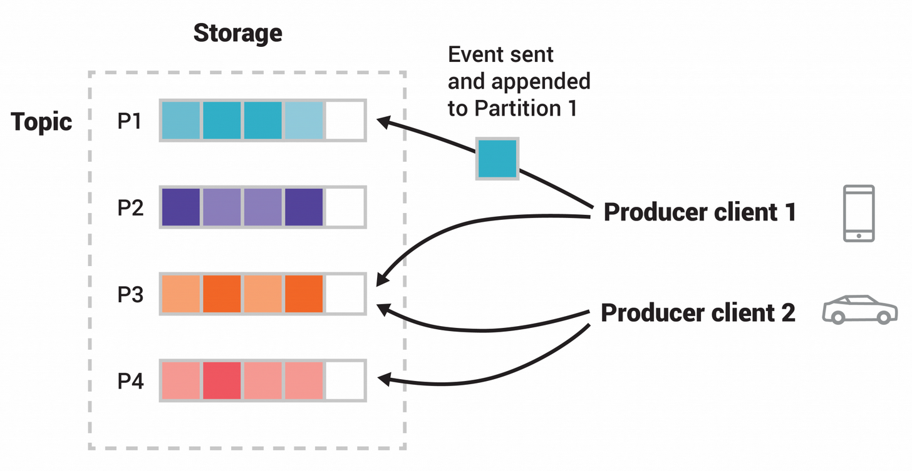
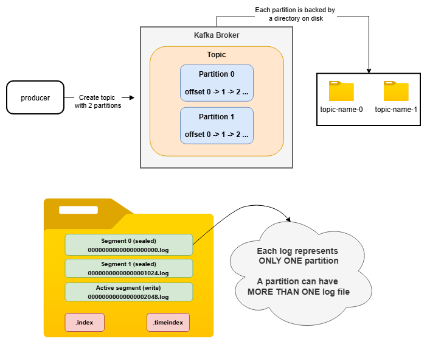
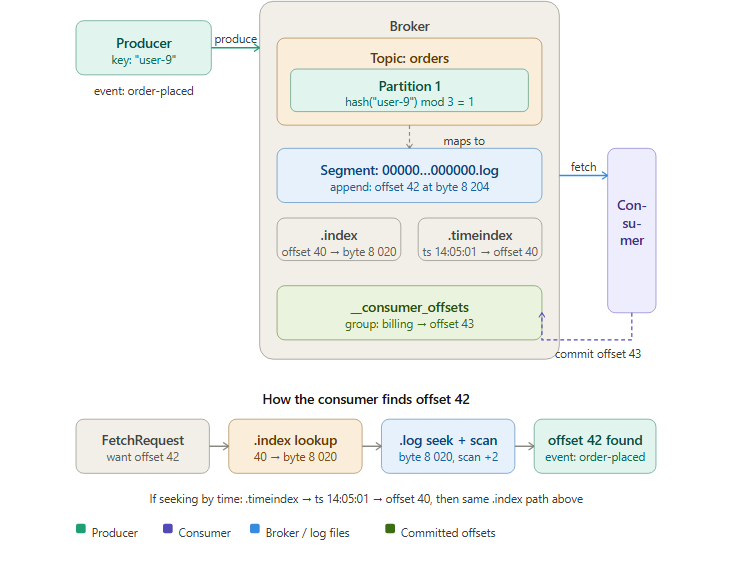
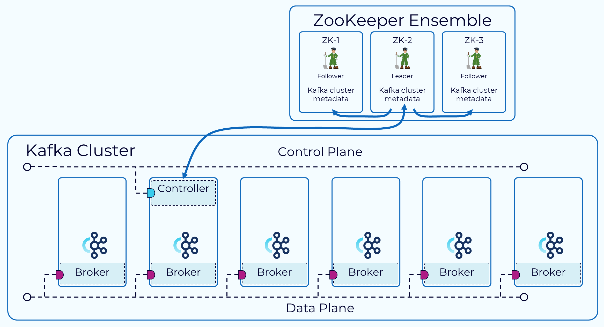
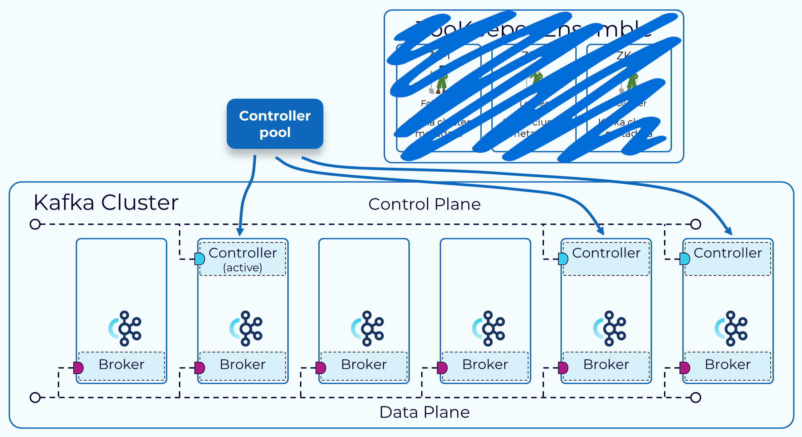
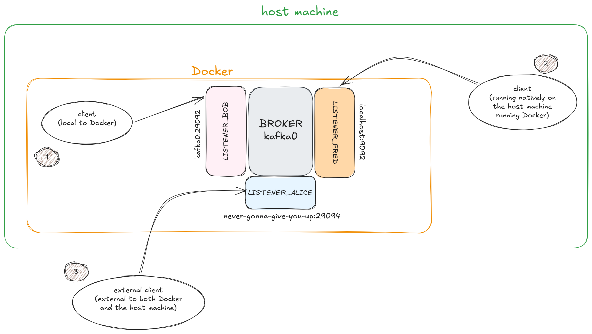
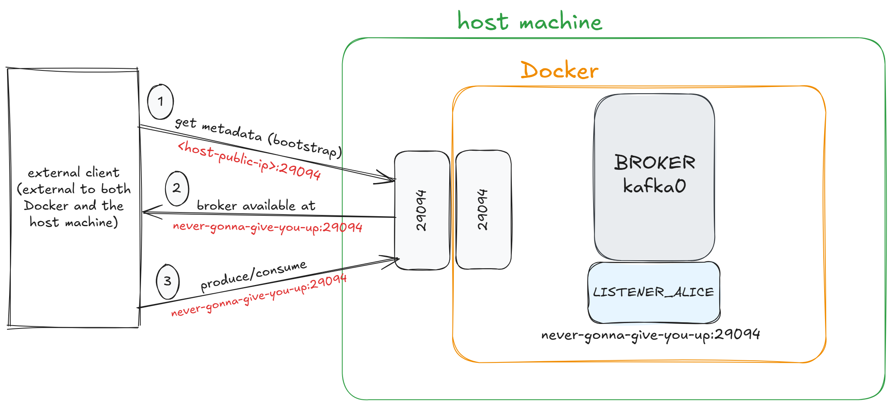

# Introduction to Stream Processing

## What is Stream Processing?

`Stream processing` is a way of handling data **continuously** as it arrives, _instead of_ storing it first and processing it later in batches. Data flows as a live stream of events (e.g., clicks, transactions, sensor readings), and computations (like filtering, aggregating, or detecting patterns) happen in real time.\
We need stream processing because many modern applications require **low latency** and immediate insights. Waiting minutes or hours (as in **batch processing**) would be too slow for use cases like monitoring systems, real-time recommendations, or financial risk detection.

> For example, in bank domain, we have `fraud detection`: every credit card transaction is analyzed instantly to flag suspicious activity before it completes.

# Apache Kafka

## What is Kafka?

Apache Kafka is an event streaming platform. Kafka combines 3 key capabilities:

- To **publish** (write) and **subscribe to** (read) streams of events.
- To **store** streams of events durably and reliably (for as long as you want).
- To **process** streams of events as they occur or retrospectively.

> The **publish/subscribe** messaging system is a communication model where publishers send messages to a topic without knowing the subscribers. Subscribers will subscribe to the specific topics and receive published messages. This helps decouple the producers and consumers.


_Ref: https://newsletter.systemdesign.one/p/how-kafka-works_

## How does Kafka work?

Kafka is a **distributed system** consisting of `servers` and `clients` that communicate via a high-performance TCP network protocol.

- `Servers`: Kafka is run as a cluster of one or more servers that can span multiple datacenters or cloud regions. Some of these servers form the storage layer, called the `brokers`.
- `Clients`: They allow you to write distributed applications and microservices that read, write, and process streams of events in parallel, at scale, and in a fault-tolerant manner.

## Main concepts and Terminology

### Log Data Structure

Kafka is built upon the [Log Data Structure](https://topicpartition.io/definitions/the-log). It is **append-only**: records are **added** to the end of the log (no deletes or updates allowed) and **reads** go from left to right, in the order the records were added.



Each record in the log has a unique monotonically increasing number called an **offset**. The offset refers to the record and denotes its order.

### Event

An `event` (also called _record_ or _message_) records the fact that "something happened" in the world or in your business. **It is an entry** in the `log`. \
Conceptually, an event has a **key, value, timestamp**, and _optional_ **metadata headers**.
E.g.,

- Event key: “Alice”
- Event value: “Made a payment of $200 to Bob”
- Event timestamp: “Jun. 25, 2020 at 2:06 p.m.”

### Broker & Cluster

- A Kafka `broker` is a single **server** that stores data and serves client requests: receiving messages from producers, writing them to disk in **topics**, and lets consumers read them.
- A Kafka `cluster` is simply **a group of multiple brokers** working together as one system. Instead of putting all data on a single machine, Kafka spreads partitions across brokers in the cluster for scalability and fault tolerance.

### Producers & Consumers

- `Producers` are those client applications that **publish (write)** events to Kafka
- `Consumers` are those that **subscribe to (read and process)** these events.


_Ref: https://hnasr.substack.com/p/apache-kafka-architecture_

> In Kafka, **producers** and **consumers** are fully decoupled and agnostic of each other, which is a key design element to achieve the high scalability that Kafka is known for. \
> For example, **producers** never need to wait for **consumers**. Kafka provides various guarantees such as the ability to process events exactly-once.

### Topics

Events are organized and durably stored in `topics`. A topic is similar to a **folder** in a filesystem, and the `events` are the **files** in that folder.

> An example topic name could be 'payments'. Topics in Kafka are always **multi-producer** and **multi-subscriber**: a topic can have zero, one, or many producers that write events to it, as well as zero, one, or many consumers that subscribe to these events. \
> **Events** in a topic can be read as often as needed as they are NOT deleted after consumption. Instead, you define for how long Kafka should retain your events through a **per-topic configuration** setting.

Topics are **partitioned**, meaning a topic is spread over a number of **buckets** located on different Kafka brokers. When a new event is **published to a topic**, it is actually appended to one of the topic's partitions. Events with the same event key (e.g., a customer or vehicle ID) are written to the same partition, and consumers will always read that partition's events in **exactly the same order** as they were written.



In the figure above, the topic has four partitions P1-P4.
Events with the **same key** (denoted by their color in the figure) are **written to the same partition**.

To make your data **fault-tolerant** and **highly-available**, every `topic` can be **replicated**, even across geo-regions or datacenters, so that there are always **multiple brokers** that have a copy of the data.

> A common production setting is a **replication factor of 3**, i.e., there will always be three copies of your data.

## Workflow

- **Producer → Broker** _(refer to the image below)_
  1. The **producer** connects to the broker and writes (produces) messages to a _named topic_. Kafka appends each message to one of the topic's partitions, assigning it a sequential **offset number**.
  2. The **broker** durably stores messages in ordered, append-only _partitions_. Each partition is backed by a _directory on disk_ with several files inside. One of those file is `.log` and is called a `segment`, i.e., a plain _append-only_ file named after the first offset they contain (e.g., **00000000000000002048.log**). Each message written to this partition is going to this `.log` file.
  3. When a `segment` grows past a configured size or age, it is **sealed** and a new **active segment** is opened. Only the **active segment** is written to, whereas **sealed segments** are read-only.



- **Broker → Consumer**
  1. The **consumer** polls the broker for new messages, by sending a **FetchRequest** to the broker specifying: `topic`, `partition`, and the `fetch offset` — the next offset it wants to read. On first start, the offset comes from the group's last committed position stored in \_\_consumer_offsets.
     > `__consumer_offsets` is itself a Kafka **topic** that keeps track of messages read by each consumer and topic.
  2. After processing, the consumer **commits the new offset** back to the broker so it can resume from the right place on the next poll.

## 📁 The overall storage hierarchy

```bash
Topic: "viewer-activity"
│
├── Partition 0 (folder: /data/viewer-activity-0/)
│   ├── 00000000000000000000.log (actual message)
│   ├── 00000000000000000000.index (offset lookup map)
│   ├── 00000000000000000000.timeindex (timestamp lookup map)
│   ├── 00000000000000850000.log
│   ├── 00000000000000850000.index
│   ├── 00000000000000850000.timeindex
│   └── 00000000000001700000.log (active segment)
│
├── Partition 1 (folder: /data/viewer-activity-1/)
│   └── [similar segment files...]
│
└── Partition 2 (folder: /data/viewer-activity-2/)
    └── [similar segment files...]
```

## Concrete example

- A producer sends an **order-placed event** with key `"user-9"` to the `orders` topic. The partitioner hashes the key and routes it to **Partition 1**.
- The **broker** appends the event to the active segment file at **offset 42**, **byte position 8,204**. It then updates the **sparse** `.index` _(offset 40 → byte 8,020)_ and `.timeindex` _(timestamp 14:05:01 → offset 40)_.

> The `.index` file is **sparse**, so it doesn't store an entry for every single offset, only for every ~4 KB of log data written. Offsets 41, 42, 43… all fall inside that same 4 KB window, so none of them get their own index entry. This keeps the `.index` file tiny even for partitions with billions of messages.



- When the consumer wants **offset 42**, it binary-searches the `.index`, lands on the nearest entry _(offset 40 at byte 8,020)_, then scans forward 2 records in the `.log` to reach **offset 42**. If the consumer had searched by timestamp instead, the `.timeindex` would first resolve the time to **offset 40**, and then the same **.index → .log** path would follow.

- After processing, the consumer commits **offset 43** (the next one to read) back to `__consumer_offsets`, so it knows where to resume after a restart.

## ZooKeeper vs KRaft

### ZooKeeper

`ZooKeeper` was Kafka's original external dependency for **cluster coordination**. Every broker registered itself in `ZooKeeper` on startup, and `ZooKeeper` held all **cluster metadata** — which topics exist, how many partitions they have, which broker is the leader for each partition, and which brokers are alive.

_Leader election_ happened via ZooKeeper's distributed lock mechanism: the **active Kafka controller** was whichever broker held a special **ephemeral ZK node**.

If it died, `ZooKeeper` triggered a new election. Brokers watched ZooKeeper for changes using a "watch" mechanism, receiving notifications whenever **metadata changed**.


_Ref: https://developer.confluent.io/courses/architecture/control-plane/_

### KRaft

`KRaft` (Kafka Raft) is the **consensus protocol** for **metadata management** built directly into Kafka, eliminating the need for **ZooKeeper** entirely.



In `KRaft`, a subset of brokers are designated as controllers, and these controllers provide the consensus services that used to be provided by `ZooKeeper`. All cluster metadata are now stored in a special **internal topic** called **@metadata**, which is itself just a Kafka log.

## Installation

## Kafka configuration

When installing Kafka via Docker, the `docker-compose.yaml` file can be seen as below:

```yaml
kafka0: # a broker
  image: "confluentinc/cp-enterprise-kafka:5.2.1"
  ports:
    - "9092:9092"
    - "29094:29094"
  environment:
    KAFKA_LISTENERS: LISTENER_BOB://kafka0:29092,LISTENER_FRED://kafka0:9092,LISTENER_ALICE://kafka0:29094
    KAFKA_ADVERTISED_LISTENERS: LISTENER_BOB://kafka0:29092,LISTENER_FRED://localhost:9092,LISTENER_ALICE://never-gonna-give-you-up:29094

    # Maps each listener name to its security protocol. PLAINTEXT:PLAINTEXT means no encryption, no authentication. In production you'd use EXTERNAL:SSL or EXTERNAL:SASL_SSL here to encrypt traffic from outside.
    KAFKA_LISTENER_SECURITY_PROTOCOL_MAP: LISTENER_BOB:PLAINTEXT,LISTENER_FRED:PLAINTEXT,LISTENER_ALICE:PLAINTEXT

    # Specifies which listener brokers use to talk to each other for replication — i.e. followers fetching data from the leader.
    KAFKA_INTER_BROKER_LISTENER_NAME: LISTENER_BOB
```

### Understanding Kafka listeners

When a client _(producer/consumer)_ connects to a Kafka cluster, it actually connects to a `broker`. When a client connects, the `broker` returns the **metadata** (or **bootstrap**) the client should then use to connect for producing/consuming messages.

Each Kafka instance has a set of `listeners` and `advertised listeners`.

- `LISTENERS` are what interfaces Kafka binds to - guiding Kafka for **incoming connections**. It is purely a **networking instruction** to the OS: "bind to this interface and port".
- `ADVERTISED_LISTENERS` configure how clients should connect to the cluster. Clients will base on this returned **advertised address** from Kafka broker for connection.

Now, let's check out some config _(from the above configuration)_ to understand more clearly how listeners work.

```yaml
KAFKA_LISTENERS: LISTENER_BOB://kafka0:29092,
  LISTENER_FRED://kafka0:9092,
  LISTENER_ALICE://kafka0:29094
KAFKA_ADVERTISED_LISTENERS: LISTENER_BOB://kafka0:29092,
  LISTENER_FRED://localhost:9092,
  LISTENER_ALICE://never-gonna-give-you-up:29094
```



- 1/ `Inter-broker` _(within the Docker network)_: connect using **listener BOB**, with **port 29092** and **hostname kafka0**. Since **port 29092** is **NOT EXPOSED** in the Docker port mappings, **LISTENER_BOB** is only reachable from within the Docker network (e.g., other containers).
- 2/ `Host machine` (clients running natively on the host machine running Docker): connect using **listener FRED**, with **port 9092** and **hostname localhost**. Port 9092 is exposed by the Docker container and therefore becomes available to connect to.
  > When clients connect, they are given the hostname localhost for the broker’s metadata, and so connect to this when reading/writing data.
- 3/ `External clients`: connect using **listener ALICE** with **port 29094** and **hostname never-gonna-give-you-up**. This listener is designed to serve clients that are **external to both Docker and the host machine**. <br>
  ⚠️ However, this ONLY WORKS if the hostname `never-gonna-give-you-up` **RESOLVES LOCALLY** _(i.e., in the client's local environment, the hostname will resolve into the IP that routes to the broker)_!

### 🔎 A closer look on how the client connects

> I will be using the scenario when **external clients connect to Kafka broker**. Other scenarios are similar.

If a client wants to send/read message from Kafka (broker), it first needs to initiate a **metadata request** (aka the **bootstrap call**).

We, as the operators, must initially decide **which port external clients should use** (in this case, `port 29094`). So,



- 1/ External client makes the **initial connection** _(bootstrap)_ to Kafka broker, which is via `<host-public-ip>:29094`. <br>
  Kafka broker will then match the incoming connection to a listener based purely on **the port it arrives on**, by looking at the **bindings**. When the external client hits the host on **port 29094**, because Docker has already exposed the **port 29094** (`29094:29094`), Docker forwards it to **port 29094** inside the container, which Kafka has bound to `LISTENER_ALICE`.
- 2/ Kafka broker replies with LISTENER*ALICE's **advertised address** (`never-gonna-give-you-up:29094`). Basically, Kafka says: *"To talk to me over this listener, connect to `never-gonna-give-you-up:29094`"\_
- 3/ The client tries to connect to `never-gonna-give-you-up:29094`. <br>
  In this case, we assume that the hostname **resolves locally** _(e.g. via /etc/hosts or DNS)_, it resolves to the host's public IP. Then, the client reconnects to that IP on `port 29094`. Now, the client can freely produce/consume data towards Kafka broker.

# A Real-life scenario using Kafka (Ecommerce)

## Debezium

`Debezium` is an open source project that provides a low latency data streaming platform for **change data capture** _(CDC)_. Start it up, point it at your databases, and your apps can start responding to all of the **inserts, updates, and deletes** that other apps commit to your databases.

> **Only committed changes** are visible, so your application doesn't have to worry about transactions or changes that are rolled back. Additionally, your application can be stopped and restarted at any time, and it will be able to **consume all of the events** it missed while it was not running, ensuring that all events are processed correctly and completely.

# Reference

[1]: https://vkontech.com/exploring-kafka-listeners-in-docker-part-1/ \
[2]: https://www.confluent.io/blog/kafka-listeners-explained/ \
[3]: https://developer.confluent.io/confluent-tutorials/kafka-on-docker/ \
[4]: https://docs.docker.com/guides/kafka/
